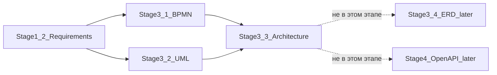

# ARCH-MAP — Трассировка архитектуры к требованиям

**Проект:** Employee Service  
**Тип:** Traceability matrix  
**Файл индекса:** [architecture-description.md](./architecture-description.md)

---

## 1. Назначение

Связать логические компоненты Stage 3.3 с FR / BR / NFR / UC / ACL и явно показать архитектурное отражение критичных правил. Новые требования **не вводятся**.

---

## 2. Матрица: компонент → требования

| Компонент | FR | BR | NFR / ACL | UC |
| :--- | :--- | :--- | :--- | :--- |
| Auth Module | FR-AUTH-01, FR-AUTH-02 | — | NFR-SEC-01/03/04 | UC-01 |
| Authorization Module | FR-AUTH-03 | BR-01, BR-13–16, BR-21, BR-27 | NFR-SEC-02/05; ACL-01…09 | все защищённые |
| Cabinet Module | FR-CAB-01 | — | — | UC-02 |
| Catalog Module | FR-CAT-01…03 | BR-10, BR-26 (live schema) | — | UC-03 |
| Request Module | FR-REQ-01/02/04–08 | BR-07, BR-19, BR-28 | — | UC-04, UC-06, UC-10 |
| Submit Orchestrator | FR-REQ-03, FR-REQ-09 | BR-08, BR-18, BR-20, BR-22, BR-26 | NFR-REL-01/03 | UC-05 |
| Snapshot Module | (через submit) | BR-08, BR-09, BR-22, BR-26 | NFR-REL-03 | UC-05 |
| Approval Engine | FR-APP-01…07 | BR-02–05, BR-14, BR-15, BR-17, BR-21, BR-25 | NFR-REL-01/02 | UC-07…09 |
| Admin Config Module | FR-ADMIN-01…06, FR-ADMIN-07/08 | BR-09, BR-10, BR-12, BR-18, BR-27 | ACL-04, ACL-09 | UC-11, UC-12, UC-15 |
| Notification Module | FR-NOTIF-01…03 | BR-11, BR-23, BR-29 | — | UC-13 |
| Audit Module | FR-AUDIT-01, FR-AUDIT-02 | BR-24 | NFR-LOG-02/03 | UC-14 |
| HTTP / API Layer | — | — | NFR-PERF-03, NFR-LOG-01, NFR-USB-02 | — |
| Web SPA (UI-зоны) | отображение FR областей | — | NFR-USB-01/03 | UC-01…15 (UI) |
| PostgreSQL | персистентность | — | NFR-AVL-02, NFR-DEP-01, NFR-MNT-02 | — |

---

## 3. Критичные правила — архитектурное отражение

| Правило | Требование | Где в архитектуре | TX / ошибка |
| :--- | :--- | :--- | :--- |
| Route snapshot только при первом submit | BR-08 | Submit Orchestrator → Snapshot Module create-once | ADR-TX-01 |
| Route snapshot не меняется при resubmit | BR-22 | Snapshot: skip create; Approval читает существующий | ADR-TX-01 |
| Schema/value snapshot при каждом успешном submit | BR-26, BR-22 | Snapshot upsert после валидации live schema | ADR-TX-01 |
| Конфиг admin не ретроактивен | BR-09 | Admin Config → live only; runtime → RouteSnapshot | ADR-TX-04 |
| First-approve wins | BR-03 | Approval Engine: complete + cancel siblings | ADR-TX-02 |
| Self-approval prohibition | BR-21 | Authorization + Approval Engine pre-check | `ERR_FORBIDDEN_APPROVAL` |
| Comment required reject/return | BR-25 | Approval Engine validation | `ERR_VALIDATION` |
| RBAC / ownership | BR-01/13–16, ACL-* | Authorization Module | 403 / 404 по NFR-SEC-02/05 |
| История | BR-24, NFR-LOG-02 | Audit Module | та же TX (NFR-REL-01) |
| In-app notifications | BR-11, BR-23, BR-29 | Notification Module | та же TX; rollback при failure |

---

## 4. Dual snapshot — сводка

| Момент | Route snapshot | Schema/value snapshot | Модули |
| :--- | :--- | :--- | :--- |
| Первый submit `draft → in_approval` | Создаётся | Создаётся | Submit + Snapshot |
| Resubmit `returned → in_approval` | Без изменений | Обновляется | Submit + Snapshot |
| Пока `in_approval` | Только чтение для next stage | Зафиксированные данные для согласующих | Approval Engine + Snapshot |
| Admin меняет live config | Не затрагивает | Не переписывает in-flight до returned-edit/resubmit | Admin Config |

Согласовано с BPMN §3 snapshot и UML-CL-01 / UML-SEQ-01.

---

## 5. NFR → архитектурный ответ

| NFR | Ответ Stage 3.3 |
| :--- | :--- |
| NFR-SEC-01…06 | Auth Module + Authorization + ADR-SEC-*; HTTPS только внешний демо |
| NFR-REL-01…03 | ADR-TX-* + Snapshot immutability + idempotent approval |
| NFR-PERF-01…04 | Монолит + pagination; измерения — этап реализации |
| NFR-SCL-01/02 | Stateless JWT; конфиг поддерживает 50 типов / 10 этапов |
| NFR-LOG-01…03 | HTTP logs + Audit Module; retention как политика |
| NFR-DEP-01…03 | Compose Web/API/DB; secrets env |
| NFR-USB-01…03 | UI-зоны + error mapping RU |
| NFR-AVL-01/02 | Compose; volume DB; JWT без sticky session |

---

## 6. ADR-реестр (не требования)

| ID | Суть | Файл |
| :--- | :--- | :--- |
| ADR-CNT-01…04 | Монолит, одна БД, JWT на клиенте, FE без authoritative BR | container-diagram.md |
| ADR-CMP-01…04 | Список модулей/UI-зон, Submit Orchestrator, AuthZ cross-cut | component-diagram.md |
| ADR-TX-01…04 | Детализация транзакций use case | data-flows.md |
| ADR-SEC-01…03 | bcrypt как выбор; хранение JWT; middleware JWT | security-and-crosscutting.md |
| ADR-ERR-01…02 | Центральный error mapping | security-and-crosscutting.md |
| ADR-LOG-01 | Структурированный tech log | security-and-crosscutting.md |
| ADR-NOTIF-01 | Pull UI для in-app (без WebSocket) | security-and-crosscutting.md |

---

## 7. Связь слоёв документации

---

## 8. Проверка полноты критичных тем пользователя

| Тема | Покрыто |
| :--- | :---: |
| Границы системы | ARCH-CTX |
| Логические компоненты FE/BE/DB | ARCH-CNT, ARCH-CMP |
| Взаимодействие и потоки данных | ARCH-FLOW |
| Внешние зависимости только из требований | ARCH-CTX (нет runtime) |
| Где бизнес-правила | ARCH-CMP §5, ARCH-MAP §3 |
| Безопасность | ARCH-SEC |
| Ошибки | ARCH-SEC §4 |
| Аудит и уведомления | ARCH-SEC §5–6, ARCH-FLOW |
| Масштабируемость и производительность | ARCH-SEC §7 |
| Route / schema snapshots | ARCH-MAP §4, ARCH-FLOW A |
| First-approve / self-approval / comment | ARCH-FLOW B, ARCH-MAP §3 |
| RBAC / history / in-app | ARCH-CMP, ARCH-SEC |

---

## 9. Границы

- Матрица не изменяет ID и формулировки требований.
- ADR не трактуются как FR/BR/NFR.
- ERD и OpenAPI остаются следующими этапами.
