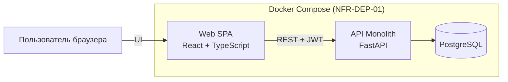

# ARCH-CNT — Container Diagram (Web / API / DB)

**Проект:** Employee Service  
**Тип:** Container (C4 Level 2, аналитический)  
**Файл индекса:** [architecture-description.md](./architecture-description.md)

---

## 1. Назначение

Описать технические контейнеры MVP, уже заданные Vision / NFR: SPA, API, PostgreSQL, поставка через Docker Compose. Без cloud-топологии и без микросервисов.

---

## 2. Контейнеры

| Контейнер | Технология (Vision / NFR) | Ответственность |
| :--- | :--- | :--- |
| **Web (SPA)** | React + TypeScript | UI личного кабинета, каталога, заявок, очереди согласующего, admin, уведомлений |
| **API (Backend)** | Python + FastAPI | Бизнес-логика, AuthN/AuthZ, согласование, snapshot, audit, notifications; REST |
| **Database** | PostgreSQL | Персистентность сущностей предметной области (логическая; ERD — позже) |

**Поставка (требование NFR-DEP-01):** Docker Compose поднимает db + api + web. Секреты через env (NFR-DEP-03).

---

## 3. Взаимодействия

| From → To | Протокол / смысл | Примечание |
| :--- | :--- | :--- |
| Актёр → Web | HTTPS или HTTP | HTTPS обязателен для **внешнего** демо (NFR-SEC-06); локально допустим HTTP |
| Web → API | REST + JWT | Контракт OpenAPI — отдельный этап; здесь только факт REST |
| API → Database | SQL через persistence-слой | Схема/миграции — позже (NFR-MNT-02 упоминается как требование, без проектирования ERD) |

API **stateless** (NFR-SCL-01, NFR-AVL-02): нет server-side session store; состояние сессии — в JWT.

---

## 4. Диаграмма (Mermaid)

---

## 5. Решения уровня контейнеров

### 5.1. Из требований

| Тема | Источник |
| :--- | :--- |
| Стек Web / API / DB / Compose | Vision Scope §13, NFR-DEP-01 |
| JWT, TTL 8 часов, без refresh token | NFR-SEC-01, NFR-SEC-04 |
| Stateless API | NFR-SCL-01, NFR-AVL-02 |
| HTTPS на внешнем демо | NFR-SEC-06 |

### 5.2. ADR / предположения MVP

| ID | Решение | Не является |
| :--- | :--- | :--- |
| **ADR-CNT-01** | Один API-процесс (модульный монолит), без выделения отдельных backend-сервисов | Новым FR/BR |
| **ADR-CNT-02** | Одна БД PostgreSQL на весь MVP | Требованием шардирования |
| **ADR-CNT-03** | SPA хранит access JWT на клиенте (например `localStorage` или memory+sessionStorage — выбор реализации) и передаёт в `Authorization` | Новым NFR; способ хранения **не** зафиксирован в Stage 1–3.2 |
| **ADR-CNT-04** | Web не содержит authoritative бизнес-правил snapshot/approval; только UX и вызов API | Новым BR |

---

## 6. Связь с логическими модулями

Внутри контейнера **API** располагаются логические модули ([component-diagram.md](./component-diagram.md)).  
Внутри **Web** — UI-зоны по ролям.  
**Database** хранит сущности UML-CL-01 без детализации таблиц на этом этапе.

---

## 7. Трассировка

| Тип | ID |
| :--- | :--- |
| **Vision** | §13 технический контур |
| **NFR** | NFR-DEP-01…03, NFR-SEC-01/04/06, NFR-SCL-01, NFR-AVL-01/02 |
| **FR** | FR-AUTH-01 (JWT как результат login) |
| **UML** | логические области SEQ → контейнер API |

---

## 8. Границы

- Нет описания K8s, CDN, reverse proxy topology (кроме упоминания HTTPS для внешнего стенда).
- Нет OpenAPI paths и схем JSON.
- Нет ERD.
