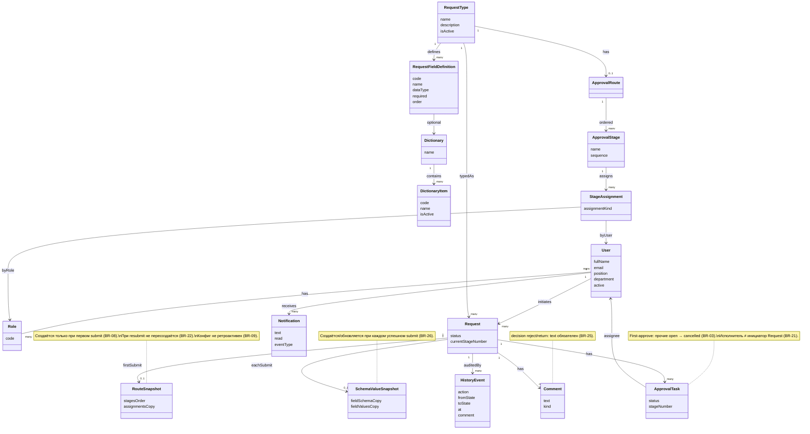

# UML-CL-01 — Conceptual Class Diagram (предметная модель)

**Проект:** Employee Service  
**Тип диаграммы:** Class (conceptual / analysis)  
**Файл индекса:** [uml-description.md](./uml-description.md)

---

## 1. Назначение

Аналитическая (conceptual) модель сущностей предметной области Employee Service — мост между глоссарием / BR и будущим ERD.

### Важно: это не ERD

| Conceptual Class (здесь) | ERD (позже, вне 3.2) |
| :--- | :--- |
| Классы анализа, смысл предметной области | Таблицы, колонки, типы SQL |
| Связи и кратности на уровне бизнеса | PK / FK / индексы / нормализация |
| Без DTO, слоёв приложения, API | Физическая схема PostgreSQL |

Новые бизнес-правила **не вводятся**. Атрибуты — на уровне анализа (без технических id-стратегий).

---

## 2. Каталог классов

### 2.1. Пользователи и роли

| Класс | Атрибуты (анализ) | Смысл |
| :--- | :--- | :--- |
| **User** | fullName, email, position, department, active | Пользователь системы |
| **Role** | code (`employee` / `approver` / `admin`) | Системная роль; у User — множество ролей (BR-16) |

### 2.2. Каталог и конфигурация

| Класс | Атрибуты (анализ) | Смысл |
| :--- | :--- | :--- |
| **RequestType** | name, description, isActive | Тип заявки / услуга каталога |
| **RequestFieldDefinition** | code, name, dataType, required, order | Поле схемы формы типа |
| **Dictionary** | name | Справочник |
| **DictionaryItem** | code, name, isActive | Элемент справочника |
| **ApprovalRoute** | — | Маршрут типа (конфиг) |
| **ApprovalStage** | name, sequence | Этап маршрута (конфиг) |
| **StageAssignment** | assignmentKind (role / user) | Явное назначение на этап (BR-12) |

### 2.3. Экземпляр заявки и snapshots

| Класс | Атрибуты (анализ) | Смысл |
| :--- | :--- | :--- |
| **Request** | status, currentStageNumber | Экземпляр заявки; инициатор = User |
| **RouteSnapshot** | stagesOrder, assignmentsCopy | Копия маршрута при **первом** submit (BR-08); при resubmit не меняется (BR-22) |
| **SchemaValueSnapshot** | fieldSchemaCopy, fieldValuesCopy | Схема и значения после **каждого** успешного submit (BR-26) |

### 2.4. Согласование, комментарии, уведомления, аудит

| Класс | Атрибуты (анализ) | Смысл |
| :--- | :--- | :--- |
| **ApprovalTask** | status (`open` / `completed` / `cancelled`), stageNumber | Задача согласующего по snapshot этапа |
| **Comment** | text, kind (free / decision) | Свободный комментарий инициатора или комментарий решения |
| **Notification** | text, read, eventType | In-app уведомление (BR-11) |
| **HistoryEvent** | action, fromState, toState, at, comment | Событие истории (BR-24) |

---

## 3. Ключевые связи и ограничения (notes)

| Тема | Ограничение (существующие BR) |
| :--- | :--- |
| Route snapshot | `Request` имеет не более одного route snapshot после первого submit; создаётся только из `draft` |
| Schema/value snapshot | Обновляется при каждом успешном submit, включая resubmit |
| Задачи | `ApprovalTask` создаётся по назначениям **RouteSnapshot**, не по live `StageAssignment` конфига |
| First-approve | При approve прочие `open` задачи того же stageNumber → `cancelled` (BR-03) |
| Self-approval | Исполнитель задачи не может быть инициатором той же `Request` (BR-21) |
| Comment on decision | Для decision reject/return `Comment.text` обязателен (BR-25); для approve — нет |
| Visibility | Сотрудник видит свои Request; approver — по своим Task; admin — все (BR-01, BR-13, BR-14) |
| Config isolation | Изменение `ApprovalRoute` / stages / assignments не изменяет существующие `RouteSnapshot` (BR-09) |

---

## 4. Диаграмма (Mermaid)

---

## 5. Трассировка

| Тип | ID |
| :--- | :--- |
| **UC** | косвенно UC-03…UC-15 (структура предметной области) |
| **FR** | FR-CAT-*, FR-REQ-*, FR-APP-*, FR-ADMIN-01…06, FR-NOTIF-*, FR-AUDIT-* |
| **BR** | BR-01, BR-03, BR-08, BR-09, BR-11–16, BR-21, BR-22, BR-24–27 |
| **AC** | AC-APP-08…10b, AC-DRAFT-01, AC-DRAFT-02, AC-ACC-* (через visibility/self-approval) |
| **Глоссарий** | термины Этапа 1 |

---

## 6. Границы

- Нет таблиц БД, PK/FK, индексов, миграций.
- Нет API DTO и слоёв приложения.
- Нет параллельных этапов и оргструктурного auto-routing (out of scope Vision).
- Новые сущности «для удобства реализации» не добавляются.
