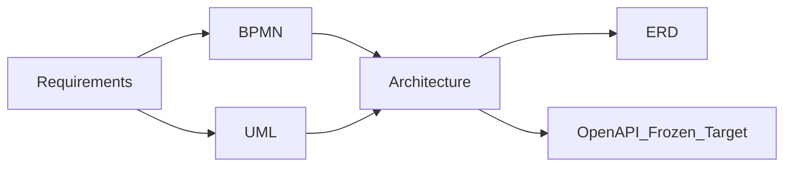

# ARCH-MAP — Трассировка архитектуры к требованиям

**Продукт:** Employee Service  
**ID:** ARCH-MAP  
**Версия:** 1.2  
**Статус:** Target architecture (Frozen Target)  
**Связанные документы:** [architecture-description.md](./architecture-description.md), [ADR-LIVE-CFG-01](./adr-live-config.md), [ADR-ACTION-01](./adr-configurable-actions.md), [ADR-AUTH-JWT-01](./adr-jwt-core-api.md), [ADR-UI-01](./adr-static-web-client.md)

---

## 1. Назначение

Связать логические компоненты Architecture с FR / BR / NFR / UC / ACL и явно показать архитектурное отражение критичных правил. Новые требования **не вводятся**.

---

## 2. Матрица: компонент → требования

| Компонент | FR | BR | NFR / ACL | UC | Scope |
| :--- | :--- | :--- | :--- | :--- | :--- |
| Auth Module (JWT) | FR-AUTH-01…03 | BR-16 | NFR-SEC-01/03/04; ADR-AUTH-JWT-01 | UC-01 | Target |
| Authorization Module | — | BR-01, BR-14–16, BR-21 | NFR-SEC-02/05; ACL-*; AC-ACC-* | защищённые сценарии | Target |
| Catalog Module | FR-CAT-01…03 | BR-10, BR-26 (live schema) | — | UC-03 | Target |
| Request Module | FR-REQ-01/02/04–08 | BR-07, BR-19, BR-28 | — | UC-04, UC-06, UC-10 | Target |
| Submit Orchestrator | FR-REQ-03, FR-REQ-09 | BR-08, BR-18, BR-20, BR-22, BR-26 | NFR-REL-01 | UC-05 | Target |
| Action Engine | — | BR-20, BR-07 (transitions) | ADR-ACTION-01 | UC-05, UC-07…09 | Target |
| Approval Engine | FR-APP-01…07 | BR-02–05, BR-14, BR-15, BR-17, BR-21, BR-25 | NFR-REL-01/02 | UC-07…09 | Target |
| Audit Module | FR-AUDIT-01, FR-AUDIT-02 | BR-24 | NFR-LOG-02/03 | UC-14 | Target |
| Notification Module | FR-NOTIF-01…03 | BR-11, BR-23, BR-29 | — | UC-13 | Target |
| HTTP / API Layer + static | — | — | NFR-PERF-03, NFR-LOG-01, NFR-USB-02; ADR-UI-01 | — | Target |
| Web static client (реализованный срез) | Login / My Requests / Detail / Notifications | — | NFR-USB-01/03 | UI среза | Target |
| PostgreSQL | персистентность | — | NFR-AVL-02, NFR-DEP-01, NFR-MNT-02 | — | Target |
| Cabinet Module | FR-CAB-01 | — | — | UC-02 | Backlog |
| Admin Config Module | FR-ADMIN-01…08 | BR-09, BR-10, BR-12, BR-18, BR-27 | ACL-04, ACL-09 | UC-11, UC-12, UC-15 | Future / backlog |

**Historical (не CURRENT):** Auth Module via demo-header — [ADR-AUTH-DEMO-01](./adr-demo-role-header.md) Superseded.

---

## 3. Критичные правила — архитектурное отражение

| Правило | Требование | Где в архитектуре | TX / ошибка |
| :--- | :--- | :--- | :--- |
| Submit читает live route | BR-08 | Action Engine + Submit Orchestrator + Approval Engine | ADR-TX-01 / ADR-LIVE-CFG-01 |
| Resubmit с первого live-этапа | BR-06, BR-22 | current_stage_id → stage 1; новые tasks | ADR-TX-01 |
| Working values | BR-26 | RequestFieldValue по live schema | — |
| Live config in-flight caveat | BR-09, ADR-LIVE-CFG-01 | Admin Config (Future); guard на удаление stage | ADR-TX-04 (Future) |
| available-actions + execute | ADR-ACTION-01 | Action Engine | ADR-TX-02 |
| approve_advance | ADR-ACTION-01 | Action Engine + Approval Engine | ADR-TX-02 |
| First-approve wins | BR-03 | Approval Engine: complete + cancel siblings | ADR-TX-02 |
| Self-approval prohibition | BR-21 | Authorization + Action/Approval pre-check | `FORBIDDEN_APPROVAL` |
| Comment required reject/return | BR-25 | Action Engine validation | `VALIDATION` |
| RBAC / ownership | BR-01/14–16, ACL-* | Authorization Module (`role_id`) | 403 / 404 по NFR-SEC-02/05 |
| История | BR-24, NFR-LOG-02 | Audit Module | та же TX (NFR-REL-01) |
| In-app notifications | BR-11, BR-23, BR-29 | Notification Module | та же TX |

---

## 4. Live config — сводка

Канон: [ADR-LIVE-CFG-01](./adr-live-config.md). Snapshot (ADR-SNAP-01) — **Superseded** / HISTORICAL.

| Момент | current_stage_id | ApprovalTask | Модули |
| :--- | :--- | :--- | :--- |
| Первый submit | Первый live ApprovalStage | Из live StageAssignment | Action + Submit + Approval |
| Resubmit | Снова первый live-этап | Новые tasks этапа 1 | Action + Submit + Approval |
| Approve (не последний) | Следующий live ApprovalStage | Новые tasks | Action + Approval |

**Не создаётся:** RouteInstance, FieldValueVersion.

---

## 5. NFR → архитектурный ответ

| NFR | Ответ Architecture |
| :--- | :--- |
| NFR-SEC-01…04 (JWT/login) | Target: ADR-AUTH-JWT-01 |
| NFR-SEC-02/05/06 | Authorization + HTTPS внешний демо |
| NFR-REL-01…03 | ADR-TX-* + idempotent actions; NFR-REL-03 snapshot wording → deprecated (live config) |
| NFR-PERF-01…04 | Монолит + pagination; измерения — этап реализации |
| NFR-SCL-01/02 | Без server-side session (JWT access, без refresh); конфиг 50 типов / 10 этапов |
| NFR-LOG-01…03 | HTTP logs + Audit Module; retention как политика |
| NFR-DEP-01…03 | Python + Neon/local PG; Render + Neon; FastAPI+static+DB; secrets env |
| NFR-USB-01…03 | UI-зоны static + error mapping RU |
| NFR-AVL-01/02 | Локальный/демо-стенд по DEP-01; API stateless; PostgreSQL |

---

## 6. ADR-реестр (не требования)

### 6.1. Active ADR (Target / Future)

| ID | Суть | Файл | Статус |
| :--- | :--- | :--- | :--- |
| ADR-CNT-01, 02, 04 | Монолит, одна БД, FE без authoritative BR | container-diagram.md | Target |
| ADR-CMP-01…05 | Список модулей/UI-зон, Submit, Action Engine, AuthZ | component-diagram.md | Target |
| ADR-TX-01…03 | Транзакции submit / action / cancel | data-flows.md | Target |
| ADR-TX-04 | Admin save/activate | data-flows.md | Future / backlog |
| ADR-SEC-01 | bcrypt | security-and-crosscutting.md | Target |
| ADR-SEC-03 | JWT middleware / no server session | security-and-crosscutting.md | Target via ADR-AUTH-JWT-01 |
| ADR-ERR-01…02 | HTTP mapping / validation-before-TX | security-and-crosscutting.md | Target |
| ADR-ERR-03 | Nested error envelope | adr-error-envelope.md | Accepted |
| ADR-LOG-01 | Структурированный tech log | security-and-crosscutting.md | Target |
| ADR-NOTIF-01 | Pull UI для in-app | security-and-crosscutting.md | Target |
| ADR-LIVE-CFG-01 | Live config; no snapshot | adr-live-config.md | Accepted |
| ADR-ACTION-01 | ProcessTransition, Action Engine | adr-configurable-actions.md | Accepted |
| ADR-AUTH-JWT-01 | JWT Bearer | adr-jwt-core-api.md | Accepted |
| ADR-UI-01 | Static HTML+JS от FastAPI | adr-static-web-client.md | Accepted |
| ADR-ORG-01 | Org model; one role_id | adr-org-model.md | Accepted |
| ADR-ID-01 | User UUID; business int PK | adr-id-strategy.md | Accepted |

### 6.2. Superseded / HISTORICAL ADR

| ID | Суть | Файл | Статус / замена |
| :--- | :--- | :--- | :--- |
| ADR-SNAP-01 | RouteInstance + FieldValueVersion | adr-snapshot-submit-versions.md | **Superseded** → ADR-LIVE-CFG-01 |
| ADR-AUTH-DEMO-01 | Демо-роль заголовком | adr-demo-role-header.md | **Superseded** → ADR-AUTH-JWT-01 |
| ADR-CNT-03 | JWT на клиенте React SPA | container-diagram.md | **Superseded** → ADR-UI-01 + ADR-AUTH-JWT-01 |
| ADR-CMP-02 (SPA-часть) | Отдельный SPA Web UI | component-diagram.md | **Superseded** → ADR-UI-01 |
| ADR-SEC-02 | JWT на клиенте SPA | security-and-crosscutting.md | **Superseded** (SPA); storage → ADR-AUTH-JWT-01 |

---

## 7. Связь слоёв документации

---

## 8. Проверка полноты критичных тем

| Тема | Покрыто |
| :--- | :---: |
| Границы системы | ARCH-CTX |
| Логические компоненты FE/BE/DB | ARCH-CNT, ARCH-CMP |
| Взаимодействие и потоки данных | ARCH-FLOW |
| Внешние зависимости только из требований | ARCH-CTX (нет runtime) |
| Где бизнес-правила | ARCH-CMP §5, ARCH-MAP §3 |
| Безопасность (JWT + AuthZ) | ARCH-SEC |
| Ошибки | ARCH-SEC §4 |
| Аудит; уведомления | ARCH-SEC §5–6, ARCH-FLOW |
| Масштабируемость и производительность | ARCH-SEC §7 |
| Live config / Action Engine | ADR-LIVE-CFG-01 + ARCH-MAP §4, ARCH-FLOW A/B |
| First-approve / self-approval / comment | ARCH-FLOW B, ARCH-MAP §3 |
| RBAC / history | ARCH-CMP, ARCH-SEC |
| Static web client | ADR-UI-01, ARCH-CNT |

---

## 9. Границы

- Матрица не изменяет ID и формулировки требований.
- ADR не трактуются как FR/BR/NFR.
- OpenAPI Frozen Target — `docs/04-api` (не изменяется этим файлом).

---

## История

| Версия | Дата | Описание |
| :--- | :--- | :--- |
| 1.1 | 2026-09-23 | Live config / Action Engine traceability |
| 1.2 | 2026-09-24 | JWT Target; ADR-DEMO Superseded; Notification Target |
