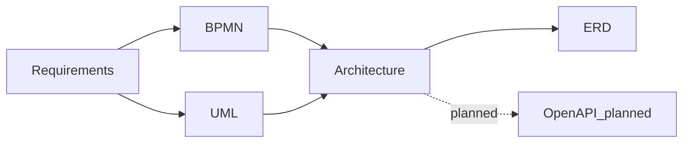

# ARCH-MAP — Трассировка архитектуры к требованиям

**Продукт:** Employee Service  
**ID:** ARCH-MAP  
**Версия:** 1.1  
**Статус:** Baseline v1.0  
**Связанные документы:** [architecture-description.md](./architecture-description.md), [Snapshot Model](../erd/snapshot-model.md), [ADR-UI-01](./adr-static-web-client.md), [ADR-AUTH-DEMO-01](./adr-demo-role-header.md)

---

## 1. Назначение

Связать логические компоненты Architecture с FR / BR / NFR / UC / ACL и явно показать архитектурное отражение критичных правил. Новые требования **не вводятся**.

---

## 2. Матрица: компонент → требования

| Компонент | FR | BR | NFR / ACL | UC | Scope |
| :--- | :--- | :--- | :--- | :--- | :--- |
| Auth Module (demo header) | — (FR-AUTH-* backlog) | — | Vision §12 п.7; ADR-AUTH-DEMO-01 | экран выбора роли | Baseline |
| Authorization Module | — | BR-01, BR-14–16, BR-21 | NFR-SEC-02/05; ACL-*; AC-ACC-* | защищённые сценарии | Baseline |
| Catalog Module | FR-CAT-01…03 | BR-10, BR-26 (live schema) | — | UC-03 | Baseline |
| Request Module | FR-REQ-01/02/04–08 | BR-07, BR-19, BR-28 | — | UC-04, UC-06, UC-10 | Baseline |
| Submit Orchestrator | FR-REQ-03, FR-REQ-09 | BR-08, BR-18, BR-20, BR-22, BR-26 | NFR-REL-01/03 | UC-05 | Baseline |
| Snapshot Module | (через submit) | BR-08, BR-09, BR-22, BR-26 | NFR-REL-03 | UC-05 | Baseline |
| Approval Engine | FR-APP-01…07 | BR-02–05, BR-14, BR-15, BR-17, BR-21, BR-25 | NFR-REL-01/02 | UC-07…09 | Baseline |
| Audit Module | FR-AUDIT-01, FR-AUDIT-02 | BR-24 | NFR-LOG-02/03 | UC-14 | Baseline |
| HTTP / API Layer + static | — | — | NFR-PERF-03, NFR-LOG-01, NFR-USB-02; ADR-UI-01 | — | Baseline |
| Web static client (UI-зоны) | отображение FR областей ядра | — | NFR-USB-01/03 | UI экранов ядра | Baseline |
| PostgreSQL | персистентность | — | NFR-AVL-02, NFR-DEP-01, NFR-MNT-02 | — | Baseline |
| Cabinet Module | FR-CAB-01 | — | — | UC-02 | Backlog |
| Admin Config Module | FR-ADMIN-01…08 | BR-09, BR-10, BR-12, BR-18, BR-27 | ACL-04, ACL-09 | UC-11, UC-12, UC-15 | Future / backlog |
| Notification Module | FR-NOTIF-01…03 | BR-11, BR-23, BR-29 | — | UC-13 | Future / backlog |

---

## 3. Критичные правила — архитектурное отражение

| Правило | Требование | Где в архитектуре | TX / ошибка |
| :--- | :--- | :--- | :--- |
| RouteInstance только при первом submit | BR-08 | Snapshot Module create-once; [Snapshot Model](../erd/snapshot-model.md) | ADR-TX-01 / ADR-SNAP-01 |
| RouteInstance не меняется при resubmit | BR-22 | Snapshot: skip rebuild | ADR-TX-01 |
| FieldValueVersion при каждом успешном submit | BR-26, BR-22 | Новая версия после валидации live schema | ADR-TX-01 / ADR-SNAP-01 |
| Конфиг admin не ретроактивен | BR-09 | live only; runtime → RouteInstance ([backlog](../../backlog.md)) | ADR-TX-04 (Future) |
| First-approve wins | BR-03 | Approval Engine: complete + cancel siblings | ADR-TX-02 |
| Self-approval prohibition | BR-21 | Authorization + Approval Engine pre-check | `ERR_FORBIDDEN_APPROVAL` |
| Comment required reject/return | BR-25 | Approval Engine validation | `ERR_VALIDATION` |
| RBAC / ownership | BR-01/14–16, ACL-* | Authorization Module | 403 / 404 по NFR-SEC-02/05 |
| История | BR-24, NFR-LOG-02 | Audit Module | та же TX (NFR-REL-01) |
| In-app notifications | BR-11, BR-23, BR-29 | Notification Module | Future / backlog; TX wording «если в scope» |

---

## 4. RouteInstance / FieldValueVersion — сводка

Краткая отсылка (канон — [Snapshot Model](../erd/snapshot-model.md), ADR [ADR-SNAP-01](./adr-snapshot-submit-versions.md)):

| Момент | RouteInstance | FieldValueVersion | Модули |
| :--- | :--- | :--- | :--- |
| Первый submit | Создаётся | Версия #1 | Submit + Snapshot |
| Resubmit | Без изменений | Новая версия | Submit + Snapshot |
| Пока `in_approval` | Чтение для next stage | Текущая версия для согласующих | Approval Engine + Snapshot |

---

## 5. NFR → архитектурный ответ

| NFR | Ответ Architecture |
| :--- | :--- |
| NFR-SEC-01…04 (JWT/login) | Backlog; Baseline AuthN = ADR-AUTH-DEMO-01 |
| NFR-SEC-02/05/06 | Authorization + HTTPS внешний демо |
| NFR-REL-01…03 | ADR-TX-* + Snapshot immutability + idempotent approval |
| NFR-PERF-01…04 | Монолит + pagination; измерения — этап реализации |
| NFR-SCL-01/02 | Без server-side session (демо-заголовок / JWT в backlog); конфиг 50 типов / 10 этапов |
| NFR-LOG-01…03 | HTTP logs + Audit Module; retention как политика |
| NFR-DEP-01…03 | Python + Neon/local PG локально; Render + Neon в облаке; runtime FastAPI+static+DB; secrets env |
| NFR-USB-01…03 | UI-зоны static + error mapping RU |
| NFR-AVL-01/02 | Локальный/демо-стенд по DEP-01; API stateless (без sticky session); персистентность PostgreSQL |

---

## 6. ADR-реестр (не требования)

| ID | Суть | Файл | Статус |
| :--- | :--- | :--- | :--- |
| ADR-CNT-01, 02, 04 | Монолит, одна БД, FE без authoritative BR | container-diagram.md | Baseline |
| ADR-CNT-03 | JWT на клиенте SPA | container-diagram.md | **Superseded** → ADR-AUTH-DEMO-01 / ADR-UI-01 |
| ADR-CMP-01…04 | Список модулей/UI-зон, Submit Orchestrator, AuthZ | component-diagram.md | Baseline; SPA-формулировка CMP-02 **Superseded** → ADR-UI-01 |
| ADR-TX-01…03 | Транзакции submit / approval / cancel | data-flows.md | Baseline |
| ADR-TX-04 | Admin save/activate | data-flows.md | Future / backlog |
| ADR-SEC-01 | bcrypt для полной auth | security-and-crosscutting.md | Backlog auth |
| ADR-SEC-02 | JWT на клиенте SPA | security-and-crosscutting.md | **Superseded** → ADR-AUTH-DEMO-01 |
| ADR-SEC-03 | JWT middleware | security-and-crosscutting.md | **Superseded** для Baseline → ADR-AUTH-DEMO-01; JWT вернётся с backlog |
| ADR-ERR-01…02 | Центральный error mapping | security-and-crosscutting.md | Baseline |
| ADR-LOG-01 | Структурированный tech log | security-and-crosscutting.md | Baseline |
| ADR-NOTIF-01 | Pull UI для in-app | security-and-crosscutting.md | Backlog |
| ADR-SNAP-01 | RouteInstance + FieldValueVersion | adr-snapshot-submit-versions.md | Baseline |
| ADR-AUTH-DEMO-01 | Демо-роль заголовком | adr-demo-role-header.md | Baseline |
| ADR-UI-01 | Static HTML+JS от FastAPI | adr-static-web-client.md | Baseline |

---

## 7. Связь слоёв документации

---

## 8. Проверка полноты критичных тем

| Тема | Покрыто |
| :--- | :---: |
| Границы системы | ARCH-CTX |
| Логические компоненты FE/BE/DB | ARCH-CNT, ARCH-CMP |
| Взаимодействие и потоки данных | ARCH-FLOW |
| Внешние зависимости только из требований | ARCH-CTX (нет runtime) |
| Где бизнес-правила | ARCH-CMP §5, ARCH-MAP §3 |
| Безопасность (demo header + AuthZ) | ARCH-SEC |
| Ошибки | ARCH-SEC §4 |
| Аудит; уведомления → backlog | ARCH-SEC §5–6, ARCH-FLOW |
| Масштабируемость и производительность | ARCH-SEC §7 |
| RouteInstance / FieldValueVersion | Snapshot Model + ARCH-MAP §4, ARCH-FLOW A |
| First-approve / self-approval / comment | ARCH-FLOW B, ARCH-MAP §3 |
| RBAC / history | ARCH-CMP, ARCH-SEC |
| Static web client | ADR-UI-01, ARCH-CNT |

---

## 9. Границы

- Матрица не изменяет ID и формулировки требований.
- ADR не трактуются как FR/BR/NFR.
- ERD и OpenAPI остаются следующими этапами.
