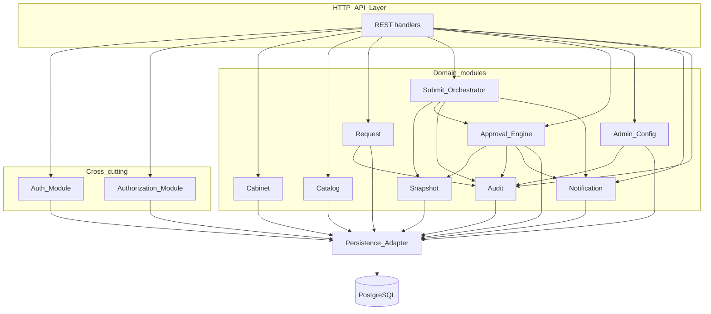

# ARCH-CMP — Component Diagram (логические модули)

**Продукт:** Employee Service  
**ID:** ARCH-CMP  
**Версия:** 1.0  
**Статус:** Baseline v1.0  
**Связанные документы:** [architecture-description.md](./architecture-description.md)

---

## 1. Назначение

Описать **логическое** разделение ответственности внутри SPA и API-монолита. Имена модулей — **ADR / предположение MVP**: способ организации кода и зон ответственности, а не новые бизнес-требования и не микросервисы.

Соответствие областям анализа UML (Validation, Snapshot, TaskFactory, Audit, Notification): те же обязанности, теперь явно привязанные к модулям архитектуры.

---

## 2. Frontend — UI-зоны (ADR-CMP-FE)

| UI-зона | Ответственность | Роли |
| :--- | :--- | :--- |
| **Auth UI** | Форма входа; сохранение/очистка JWT на клиенте (**ADR-CNT-03**) | все |
| **Cabinet UI** | Профиль; вход в списки своих заявок | `employee` |
| **Catalog UI** | Активные типы, описание, форма по live schema | `employee` |
| **Request UI** | Draft / edit / submit / resubmit / cancel / card / comments / history | `employee` (+ visibility) |
| **Approver UI** | Очередь задач; карточка; approve / reject / return | `approver` |
| **Admin UI** | Типы, поля, маршрут, этапы, назначения, справочники, реестр | `admin` |
| **Notifications UI** | Список in-app; mark as read | аутентифицированный пользователь |

**Граница ответственности FE:** отображение и ввод; навигация по union roles (BR-16) как UX.  
**Authoritative AuthZ и бизнес-правила** — только на backend.

---

## 3. Backend — логические модули (ADR-CMP-BE)

| Модуль | Граница ответственности | Ключевые требования |
| :--- | :--- | :--- |
| **HTTP / API Layer** | Приём REST, request_id, пагинация, маппинг error-matrix → ответ | NFR-PERF-03, NFR-LOG-01, NFR-USB-02 |
| **Auth Module** | Проверка credentials, password hash, выпуск/валидация JWT, current user | FR-AUTH-01…02, NFR-SEC-01/03/04 |
| **Authorization Module** | RBAC + ownership; 404 vs 403; pre-check self-approval | BR-01/13–16/21/27, ACL-*, NFR-SEC-02/05 |
| **Cabinet Module** | Чтение профиля | FR-CAB-01 |
| **Catalog Module** | Активные типы; отдача live schema для edit | FR-CAT-*, BR-10, BR-26 (live при edit) |
| **Request Module** | Create draft, edit полей, card/list, free comments, cancel | FR-REQ-*, BR-07/19/28 |
| **Submit Orchestrator** | Координация первого submit и resubmit | UC-05, BR-08/18/20/22/26 |
| **Snapshot Module** | Route snapshot (create-once); schema/value snapshot (каждый успешный submit); immutability route | BR-08/09/22/26, NFR-REL-03 |
| **Approval Engine** | Задачи этапа; approve / reject / return; first-approve; next stage / final | FR-APP-*, BR-02–05/15/17/21/25 |
| **Admin Config Module** | CRUD типа/полей/маршрута/этапов/назначений/справочников; activate | FR-ADMIN-01…06, BR-09/10/12/18/27 |
| **Notification Module** | Создание in-app; list; mark read | FR-NOTIF-*, BR-11/23/29 |
| **Audit Module** | Запись и чтение HistoryEvent | FR-AUDIT-*, BR-24, NFR-LOG-02 |
| **Persistence Adapter** | Доступ к PostgreSQL (логический слой) | NFR-MNT-02 (миграции — требование будущего этапа реализации) |

### 3.1. Замечание об оркестрации

**Submit Orchestrator** и **Approval Engine** — логические координаторы use case (ADR). Они вызывают Snapshot / Audit / Notification / Persistence внутри **одной транзакции БД**, где это требуют BR-29 и NFR-REL-01. Это не отдельные процессы и не очереди сообщений.

---

## 4. Диаграмма модулей API (Mermaid)

---

## 5. Где реализуются ключевые бизнес-правила

| Правило | Модуль-владелец | Примечание |
| :--- | :--- | :--- |
| BR-08 route snapshot при первом submit | Snapshot (+ Submit Orchestrator) | Create iff первый submit из `draft` |
| BR-22 route не пересоздаётся на resubmit | Snapshot (+ Submit Orchestrator) | Skip create; читать существующий |
| BR-26 schema/value на каждом успешном submit | Snapshot (+ Submit Orchestrator) | Upsert после валидации live schema |
| BR-09 конфиг не ретроактивен | Admin Config пишет live; runtime читает RouteInstance | Approval Engine / Submit не читают live assignments для in-flight |
| BR-03 first-approve wins | Approval Engine | В одной TX с закрытием sibling tasks |
| BR-21 self-approval | Authorization + Approval Engine | До мутаций → `ERR_FORBIDDEN_APPROVAL` |
| BR-25 comment reject/return | Approval Engine | До мутаций → `ERR_VALIDATION` |
| BR-01/13–16/27 RBAC | Authorization | FE не authoritative |
| BR-24 history | Audit | В TX с бизнес-событием (NFR-REL-01) |
| BR-11/23/29 notifications | Notification | BR-29: та же TX, иначе rollback |

---

## 6. Database (логический уровень)

Хранилище сущностей conceptual model UML-CL-01: User, Role, RequestType, RequestFieldDefinition, Dictionary*, ApprovalRoute/Stage/Assignment, Request, RouteInstance, FieldValueVersion, ApprovalTask, Comment, Notification, HistoryEvent.

**Не проектируется** на Stage 3.3: таблицы, PK/FK, индексы, JSON vs нормализация snapshot.

---

## 7. ADR сводка по компонентам

| ID | Решение |
| :--- | :--- |
| **ADR-CMP-01** | Список модулей §3 — логическое разбиение монолита |
| **ADR-CMP-02** | UI-зоны §2 — логическое разбиение SPA |
| **ADR-CMP-03** | Submit Orchestrator выделен для оркестрации RouteInstance / FieldValueVersion |
| **ADR-CMP-04** | Authorization — отдельный cross-cutting модуль, вызываемый до domain-мутаций |

Эти ADR **не** добавляют FR/BR/NFR.

---

## 8. Трассировка

| Тип | ID |
| :--- | :--- |
| **UC** | UC-01…15 → соответствующие UI-зоны и модули |
| **FR** | по областям модулей (§3) |
| **BR** | §5 |
| **UML** | UML-SEQ-01…03 области → модули; UML-CL-01 → Persistence |
| **BPMN** | BPMN-01 → Submit/Request/Snapshot; BPMN-02 → Approval Engine; BPMN-03 → Admin Config |

---

## 9. Границы

- Модули ≠ deployable services.
- Нет API-контрактов и схемы БД.
- Нет новых сущностей сверх UML-CL-01.
