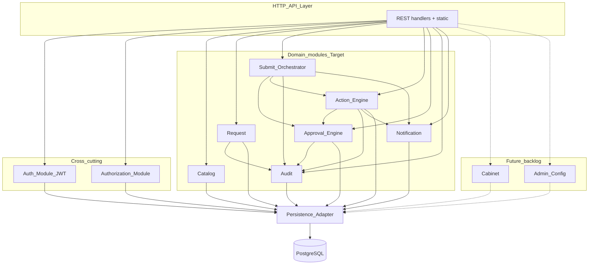

# ARCH-CMP — Component Diagram (логические модули)

**Продукт:** Employee Service  
**ID:** ARCH-CMP  
**Версия:** 1.3  
**Статус:** Target architecture (Frozen Target)  
**Связанные документы:** [architecture-description.md](./architecture-description.md), [ADR-UI-01](./adr-static-web-client.md), [ADR-AUTH-JWT-01](./adr-jwt-core-api.md), [ADR-AUTH-DEMO-01](./adr-demo-role-header.md) (Superseded)

---

## 1. Назначение

Описать **логическое** разделение ответственности внутри лёгкого веб-клиента (static HTML/JS) и API-монолита. Имена модулей — **ADR / предположение MVP**: способ организации кода и зон ответственности, а не новые бизнес-требования и не микросервисы.

Соответствие областям анализа UML (Validation, RouteReader, TaskFactory, Audit, Notification): те же обязанности, привязанные к модулям. Live config — [ADR-LIVE-CFG-01](./adr-live-config.md). Snapshot Module **удалён** из target.

---

## 2. Frontend — UI-зоны (ADR-CMP-FE / ADR-CMP-02)

### 2.1. Реализованный FE-срез (CURRENT)

| UI-зона | Ответственность | Роли |
| :--- | :--- | :--- |
| **Login UI** | Форма входа; JWT в `sessionStorage`; Bearer на запросах ([ADR-AUTH-JWT-01](./adr-jwt-core-api.md)) | все |
| **My Requests UI** | Список своих заявок | `employee` |
| **Request Detail UI** | Карточка: поля, статус, комментарии, история; discovery `available-actions` + execute actions | `employee` / `approver` (по visibility) |
| **Notifications UI** | Список in-app (mark-as-read — **Future / backlog**, FR-NOTIF-03) | авторизованный пользователь |

**Граница ответственности FE:** отображение и ввод; навигация по ролям как UX.  
**Authoritative AuthZ и бизнес-правила** — только на backend.  
Стек UI: [ADR-UI-01](./adr-static-web-client.md) — static HTML+JS от FastAPI, без React/SPA.

### 2.2. Future / не объявлены реализованными

| UI-зона | Ответственность | Статус |
| :--- | :--- | :--- |
| **Create Request UI** | Каталог активных типов + форма создания / draft / submit | Future / следующий FE-срез |
| **Approver Queue UI** | Отдельная очередь задач (list `/approval-tasks`) | Future; текущий approver flow — через Request Detail + available-actions |
| **Cabinet UI** (профиль) | Профиль; вход в списки | Future / [backlog](../../backlog.md) |
| **Notifications mark-as-read** | Отметка уведомления прочитанным (FR-NOTIF-03) | Future / [backlog](../../backlog.md) |
| **Admin UI** | Типы, поля, маршрут, этапы, назначения, справочники, реестр | Future / [backlog](../../backlog.md) |

### 2.3. Historical (не CURRENT)

| UI-зона | Бывшая ответственность | Статус |
| :--- | :--- | :--- |
| **Role Select UI** | Выбор демо-роли / демо-пользователя; заголовок ([ADR-AUTH-DEMO-01](./adr-demo-role-header.md)) | **Superseded** → Login UI + JWT |

---

## 3. Backend — логические модули (ADR-CMP-BE)

| Модуль | Граница ответственности | Ключевые требования / статус |
| :--- | :--- | :--- |
| **HTTP / API Layer** | Приём REST, request_id, пагинация, маппинг error-matrix → ответ; раздача статики | NFR-PERF-03, NFR-LOG-01, NFR-USB-02; ADR-UI-01 |
| **Auth Module** | Login → JWT; валидация Bearer; user из JWT `sub`; bcrypt | ADR-AUTH-JWT-01; FR-AUTH-*; NFR-SEC-01/03/04 |
| **Authorization Module** | RBAC через `User.role_id` + ownership; 404 vs 403; pre-check self-approval | BR-01/14–16/21, ACL-*, NFR-SEC-02/05 |
| **Catalog Module** | Активные типы; отдача live schema для edit | FR-CAT-*, BR-10, BR-26 (live при edit) |
| **Request Module** | Create draft, edit полей, card/list, free comments, cancel | FR-REQ-*, BR-07/19/28 |
| **Submit Orchestrator** | Координация submit/resubmit (в т.ч. через Action Engine); чтение live route; создание ApprovalTask | UC-05, BR-08/18/20/22/26; ADR-LIVE-CFG-01 |
| **Action Engine** | ProcessTransition; `GET .../available-actions`; `POST .../actions/{id}`; approve_advance | ADR-ACTION-01, ADR-LIVE-CFG-01 |
| **Approval Engine** | Задачи этапа; first-approve; next live stage / final (вызывается из Action Engine) | FR-APP-*, BR-02–05/15/17/21/25 |
| **Audit Module** | Запись и чтение HistoryEvent | FR-AUDIT-*, BR-24, NFR-LOG-02 |
| **Notification Module** | Создание in-app при мутациях; list; mark read | FR-NOTIF-*, BR-11/23/29 — Target API |
| **Persistence Adapter** | Доступ к PostgreSQL (логический слой) | NFR-MNT-02 |
| **Cabinet Module** | Чтение профиля | **Future / backlog** (FR-CAB-01) |
| **Admin Config Module** | CRUD типа/полей/маршрута/этапов/назначений/справочников; activate | **Future / backlog** (FR-ADMIN-*, BPMN-03) |

### 3.1. Замечание об оркестрации

**Submit Orchestrator**, **Action Engine** и **Approval Engine** — логические координаторы use case (ADR). Они вызывают Audit / Notification / Persistence внутри **одной транзакции БД** (NFR-REL-01). Primary mutation path: Action Engine.

---

## 4. Диаграмма модулей API (Mermaid)

Target-модули в сплошных узлах; Future — пунктиром.

---

## 5. Где реализуются ключевые бизнес-правила

| Правило | Модуль-владелец | Примечание |
| :--- | :--- | :--- |
| BR-08 submit читает live route | Submit Orchestrator + Approval Engine | ApprovalTask из live StageAssignment |
| BR-22 resubmit с первого live-этапа | Submit Orchestrator | current_stage_id → stage 1; новые tasks |
| BR-26 working values | Request Module | RequestFieldValue по live schema |
| BR-09 / ADR-LIVE-CFG-01 | Admin Config (Future) | Live config может затронуть in-flight; guard на удаление stage |
| approve_advance / available-actions | Action Engine (+ Approval Engine) | ProcessTransition; GET discovery + POST execute |
| BR-03 first-approve wins | Approval Engine | В одной TX с закрытием sibling tasks |
| BR-21 self-approval | Authorization + Approval Engine | До мутаций → `FORBIDDEN_APPROVAL` |
| BR-25 comment reject/return | Approval Engine | До мутаций → `VALIDATION` |
| BR-01/14–16 RBAC | Authorization | FE не authoritative; одна `role_id` |
| BR-24 history | Audit | В TX с бизнес-событием (NFR-REL-01) |
| BR-11/23/29 notifications | Notification | В TX с Action Engine / submit |

---

## 6. Database (логический уровень)

Хранилище сущностей ERD v2: User, Role, Process/Status/Action/ProcessTransition, RequestType, RequestFieldDefinition, Dictionary*, ApprovalRoute/Stage/Assignment, Request, RequestFieldValue, ApprovalTask, Comment, Notification, HistoryEvent, Company/Department/Employee.

**Не в target:** RouteInstance, FieldValueVersion ([ADR-LIVE-CFG-01](./adr-live-config.md)).

---

## 7. ADR сводка по компонентам

| ID | Решение | Статус |
| :--- | :--- | :--- |
| **ADR-CMP-01** | Список модулей §3 — логическое разбиение монолита | Target |
| **ADR-CMP-02** | UI-зоны §2 — логическое разбиение клиента | Target для §2.1; Role Select / SPA — Historical |
| **ADR-CMP-03** | Submit Orchestrator выделен для оркестрации submit/resubmit по live route | Target |
| **ADR-CMP-05** | Action Engine для ProcessTransition / available-actions / execute | Target (ADR-ACTION-01) |
| **ADR-CMP-04** | Authorization — отдельный cross-cutting модуль, вызываемый до domain-мутаций | Target |
| **ADR-UI-01** | Static HTML+JS от FastAPI; без React SPA | Target |
| **ADR-AUTH-JWT-01** | JWT Bearer AuthN | Accepted |

Эти ADR **не** добавляют FR/BR/NFR.

---

## 8. Трассировка

| Тип | ID |
| :--- | :--- |
| **UC** | Login + ядро заявок / согласование через actions; UC-02/11–12/15 — backlog UI |
| **FR** | по областям модулей (§3); ADMIN/CAB — backlog |
| **BR** | §5 |
| **UML** | UML-SEQ-01…02 → модули Target; UML-SEQ-03 → Admin (Future) |
| **BPMN** | BPMN-01 → Submit/Request; BPMN-02 → Approval/Action Engine; BPMN-03 → Admin Config (Future) |

---

## 9. Границы

- Модули ≠ deployable services.
- Нет API-контрактов и схемы БД.
- Нет новых сущностей сверх UML-CL-01 / ERD v2.
- Новые UI-зоны / модули сверх уже перечисленных не вводятся.

---

## История

| Версия | Дата | Описание |
| :--- | :--- | :--- |
| 1.2 | 2026-09-23 | Live config; Action Engine; Snapshot Module removed |
| 1.3 | 2026-09-24 | JWT Auth Module; Login/Notifications CURRENT; Role Select Historical |
