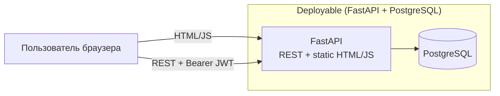

# ARCH-CNT — Container Diagram (Web / API / DB)

**Продукт:** Employee Service  
**ID:** ARCH-CNT  
**Версия:** 1.2  
**Статус:** Target architecture (Frozen Target)  
**Связанные документы:** [architecture-description.md](./architecture-description.md), [ADR-UI-01](./adr-static-web-client.md), [ADR-AUTH-JWT-01](./adr-jwt-core-api.md), [ADR-AUTH-DEMO-01](./adr-demo-role-header.md) (Superseded)

---

## 1. Назначение

Описать технические контейнеры MVP, уже заданные Vision / NFR: лёгкий веб-клиент (статика), API, PostgreSQL. Без cloud-топологии и без микросервисов.

---

## 2. Контейнеры

| Контейнер | Технология (Vision / NFR) | Ответственность |
| :--- | :--- | :--- |
| **Web (static)** | Статические HTML-страницы + JavaScript | UI: login (JWT), мои заявки, карточка заявки (available-actions / execute), уведомления. Раздаётся **тем же** FastAPI (static mount). Create UI / Admin UI / полноценная Approver Queue — вне текущего FE-среза |
| **API (Backend)** | Python + FastAPI | Бизнес-логика, AuthN (JWT) / AuthZ, live workflow + Action Engine, audit, notifications; REST |
| **Database** | PostgreSQL | Персистентность сущностей предметной области (ERD v2, live config) |

**Поставка:** NFR-DEP-01 — локально Python + Neon/local PostgreSQL; в облаке Render + Neon. Предпочтительно **один** FastAPI-процесс (API + статика); отдельный React/SPA-контейнер не используется ([ADR-UI-01](./adr-static-web-client.md)). Секреты через env (NFR-DEP-03).

**Вне текущего Web-среза:** Admin UI, профиль (Cabinet) — [backlog](../../backlog.md) (Vision §7.1 / §12).

---

## 3. Взаимодействия

| From → To | Протокол / смысл | Примечание |
| :--- | :--- | :--- |
| Актёр → FastAPI (HTML/JS) | HTTPS или HTTP | Браузер получает страницы и скрипты от FastAPI; HTTPS обязателен для **внешнего** демо (NFR-SEC-06); локально допустим HTTP |
| Браузер → FastAPI (REST) | REST + `Authorization: Bearer` JWT | [ADR-AUTH-JWT-01](./adr-jwt-core-api.md); OpenAPI — [docs/04-api](../../04-api/openapi.yaml) |
| API → Database | SQL через persistence-слой | Схема/миграции — Alembic (NFR-MNT-02) |

API **без server-side session store** (NFR-SCL-01, NFR-AVL-02): идентичность — JWT access token; refresh token **не** используется. Demo-header — **Superseded** ([ADR-AUTH-DEMO-01](./adr-demo-role-header.md)).

---

## 4. Диаграмма (Mermaid)

---

## 5. Решения уровня контейнеров

### 5.1. Из требований / Vision

| Тема | Источник |
| :--- | :--- |
| Стек: статический UI + FastAPI + PostgreSQL | Vision Scope §12 п.7–8, §13 |
| JWT Bearer AuthN; demo-header superseded | Vision §12 п.6; ADR-AUTH-JWT-01 |
| Live config (без snapshot на заявку) | ADR-LIVE-CFG-01 |
| Stateless API (без server session) | NFR-SCL-01, NFR-AVL-02 |
| HTTPS на внешнем демо | NFR-SEC-06 |
| JWT (NFR-SEC-01/04) | Target-active |

### 5.2. ADR / предположения MVP

| ID | Решение | Не является / статус |
| :--- | :--- | :--- |
| **ADR-CNT-01** | Один API-процесс (модульный монолит), без выделения отдельных backend-сервисов; статика отдаётся этим же процессом | Новым FR/BR |
| **ADR-CNT-02** | Одна БД PostgreSQL на весь MVP | Требованием шардирования |
| **ADR-CNT-03** | ~~SPA хранит access JWT на клиенте и передаёт в `Authorization`~~ | **Статус: Superseded** (React SPA) → [ADR-UI-01](./adr-static-web-client.md). JWT на static клиенте — через ADR-AUTH-JWT-01 (`sessionStorage`) |
| **ADR-CNT-04** | Web не содержит authoritative бизнес-правил approval/live-config; только UX и вызов API | Новым BR |
| **ADR-UI-01** | UI = static HTML+JS от FastAPI; React SPA не используется | см. [adr-static-web-client.md](./adr-static-web-client.md) |
| **ADR-AUTH-JWT-01** | Login → JWT access; Bearer на защищённых запросах | Accepted |

#### ADR-CNT-03 — исходный текст (Superseded — React SPA)

> SPA хранит access JWT на клиенте (например `localStorage` или memory+sessionStorage — выбор реализации) и передаёт в `Authorization`. Не является новым NFR; способ хранения **не** зафиксирован в ранних версиях архитектуры.

**HISTORICAL Baseline stub (не CURRENT):** клиент передавал демо-роль заголовком ([ADR-AUTH-DEMO-01](./adr-demo-role-header.md)).

**CURRENT:** static HTML/JS + JWT Bearer ([ADR-AUTH-JWT-01](./adr-jwt-core-api.md), [ADR-UI-01](./adr-static-web-client.md)).

---

## 6. Связь с логическими модулями

Внутри контейнера **API** располагаются логические модули ([component-diagram.md](./component-diagram.md)).  
Внутри **Web (static)** — UI-зоны реализованного среза и Future.  
**Database** хранит сущности ERD v2 / UML-CL-01.

---

## 7. Трассировка

| Тип | ID |
| :--- | :--- |
| **Vision** | §12 п.6–8; §13 технический контур |
| **NFR** | NFR-DEP-01…03, NFR-SEC-01/04/06, NFR-SCL-01, NFR-AVL-01/02 |
| **ADR** | ADR-UI-01, ADR-AUTH-JWT-01; ADR-AUTH-DEMO-01 Superseded |
| **UML** | логические области SEQ → контейнер API |

---

## 8. Границы

- Нет описания K8s, CDN, reverse proxy topology (кроме упоминания HTTPS для внешнего стенда).
- Нет OpenAPI paths и схем JSON (см. `docs/04-api`).
- Нет ERD (см. `docs/03-diagrams/erd`).
- Детали облачной топологии Render/Neon сверх NFR-DEP-01 — вне этого файла.

---

## История

| Версия | Дата | Описание |
| :--- | :--- | :--- |
| 1.1 | 2026-09-20 | Baseline: static UI + demo-header |
| 1.2 | 2026-09-24 | Target: Bearer JWT; live config; без snapshot в responsibilities |
