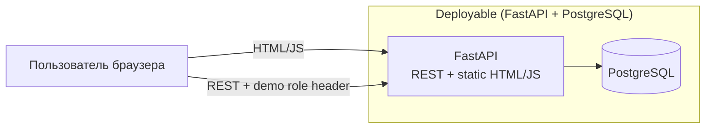

# ARCH-CNT — Container Diagram (Web / API / DB)

**Продукт:** Employee Service  
**ID:** ARCH-CNT  
**Версия:** 1.1  
**Статус:** Baseline v1.0  
**Связанные документы:** [architecture-description.md](./architecture-description.md), [ADR-UI-01](./adr-static-web-client.md), [ADR-AUTH-DEMO-01](./adr-demo-role-header.md)

---

## 1. Назначение

Описать технические контейнеры MVP, уже заданные Vision / NFR: лёгкий веб-клиент (статика), API, PostgreSQL. Без cloud-топологии и без микросервисов.

---

## 2. Контейнеры

| Контейнер | Технология (Vision / NFR) | Ответственность |
| :--- | :--- | :--- |
| **Web (static)** | Статические HTML-страницы + JavaScript | UI пяти экранов Baseline: выбор роли, мои заявки, создание, карточка, очередь согласующего. Раздаётся **тем же** FastAPI (static mount / тот же процесс) |
| **API (Backend)** | Python + FastAPI | Бизнес-логика, AuthN stub / AuthZ, согласование, snapshot, audit; REST |
| **Database** | PostgreSQL | Персистентность сущностей предметной области (логическая; ERD — позже) |

**Поставка:** NFR-DEP-01 — локально Python + Neon/local PostgreSQL; в облаке Render + Neon. Для Baseline runtime предпочтительно **один** FastAPI-процесс (API + статика); отдельный React/SPA-контейнер не используется ([ADR-UI-01](./adr-static-web-client.md)). Секреты через env (NFR-DEP-03).

**Вне Baseline Web:** admin, уведомления, профиль — [backlog](../../backlog.md) (Vision §12 п.9).

---

## 3. Взаимодействия

| From → To | Протокол / смысл | Примечание |
| :--- | :--- | :--- |
| Актёр → FastAPI (HTML/JS) | HTTPS или HTTP | Браузер получает страницы и скрипты от FastAPI; HTTPS обязателен для **внешнего** демо (NFR-SEC-06); локально допустим HTTP |
| Браузер → FastAPI (REST) | REST + демо-роль в заголовке | [ADR-AUTH-DEMO-01](./adr-demo-role-header.md); OpenAPI — отдельный этап |
| API → Database | SQL через persistence-слой | Схема/миграции — позже (NFR-MNT-02) |

API **без server-side session store** (дух NFR-SCL-01, NFR-AVL-02): в Baseline идентичность — заголовок демо-роли, не JWT. Полный JWT — [backlog](../../backlog.md).

---

## 4. Диаграмма (Mermaid)

---

## 5. Решения уровня контейнеров

### 5.1. Из требований / Vision

| Тема | Источник |
| :--- | :--- |
| Стек: статический UI + FastAPI + PostgreSQL | Vision Scope §12 п.7–8, §13 |
| Демо-роль заголовком; без login/JWT в Baseline | Vision §12 п.7; ADR-AUTH-DEMO-01 |
| Stateless API (без server session) | NFR-SCL-01, NFR-AVL-02 |
| HTTPS на внешнем демо | NFR-SEC-06 |
| JWT (полная auth) | NFR-SEC-01/04 — backlog; поставка — NFR-DEP-01 |

### 5.2. ADR / предположения MVP

| ID | Решение | Не является / статус |
| :--- | :--- | :--- |
| **ADR-CNT-01** | Один API-процесс (модульный монолит), без выделения отдельных backend-сервисов; статика отдаётся этим же процессом | Новым FR/BR |
| **ADR-CNT-02** | Одна БД PostgreSQL на весь MVP | Требованием шардирования |
| **ADR-CNT-03** | ~~SPA хранит access JWT на клиенте и передаёт в `Authorization`~~ | **Статус: Superseded** → [ADR-AUTH-DEMO-01](./adr-demo-role-header.md), [ADR-UI-01](./adr-static-web-client.md). Исходное решение сохранено в истории ниже |
| **ADR-CNT-04** | Web не содержит authoritative бизнес-правил snapshot/approval; только UX и вызов API | Новым BR |
| **ADR-UI-01** | Baseline UI = static HTML+JS от FastAPI; React SPA не используется | см. [adr-static-web-client.md](./adr-static-web-client.md) |

#### ADR-CNT-03 — исходный текст (Superseded)

> SPA хранит access JWT на клиенте (например `localStorage` или memory+sessionStorage — выбор реализации) и передаёт в `Authorization`. Не является новым NFR; способ хранения **не** зафиксирован в ранних версиях архитектуры.

**Замена Baseline:** клиент передаёт демо-роль заголовком; полноценный JWT — backlog.

---

## 6. Связь с логическими модулями

Внутри контейнера **API** располагаются логические модули ([component-diagram.md](./component-diagram.md)).  
Внутри **Web (static)** — UI-зоны по пяти экранам Baseline.  
**Database** хранит сущности UML-CL-01 без детализации таблиц на этом этапе.

---

## 7. Трассировка

| Тип | ID |
| :--- | :--- |
| **Vision** | §12 п.7–8; §13 технический контур |
| **NFR** | NFR-DEP-01…03, NFR-SEC-06, NFR-SCL-01, NFR-AVL-01/02; JWT-NFR — backlog |
| **ADR** | ADR-UI-01, ADR-AUTH-DEMO-01 |
| **UML** | логические области SEQ → контейнер API |

---

## 8. Границы

- Нет описания K8s, CDN, reverse proxy topology (кроме упоминания HTTPS для внешнего стенда).
- Нет OpenAPI paths и схем JSON.
- Нет ERD.
- Детали облачной топологии Render/Neon сверх NFR-DEP-01 — вне этого файла.
