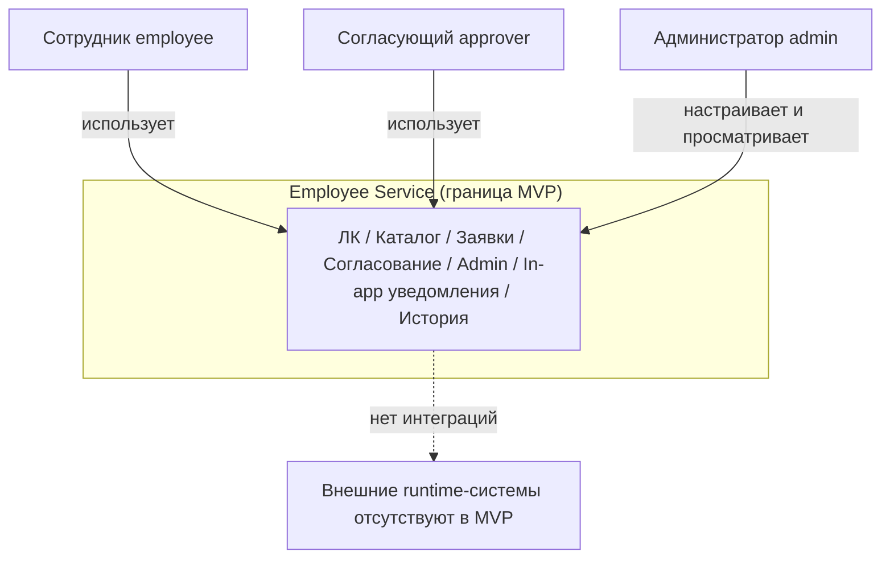

# ARCH-CTX — Context Diagram (граница системы)

**Продукт:** Employee Service  
**ID:** ARCH-CTX  
**Версия:** 1.0  
**Статус:** Baseline v1.0  
**Связанные документы:** [architecture-description.md](./architecture-description.md)

---

## 1. Назначение

Показать границу MVP Employee Service, актёров и отсутствие внешних runtime-зависимостей, уже исключённых Vision / Stage 2.

---

## 2. Система и актёры

| Участник | Тип | Смысл |
| :--- | :--- | :--- |
| **Employee Service** | Система | ЛК, каталог, заявки, согласование, admin, in-app уведомления, история |
| **Сотрудник** (`employee`) | Актёр | Инициатор заявок, профиль, каталог |
| **Согласующий** (`approver`) | Актёр | Очередь задач, approve / reject / return |
| **Администратор** (`admin`) | Актёр | Конфигурация типов/маршрутов, реестр |
| **Аутентифицированный пользователь** | Обобщение | Login, уведомления; роли — specialization (BR-16) |

Один пользователь может совмещать роли (union permissions, BR-16).

---

## 3. Внешние системы

**В MVP runtime-интеграций нет** (требование / out of scope Vision):

| Не используется | Основание |
| :--- | :--- |
| SSO / AD / LDAP | Out of scope |
| Email / push | BR-11 — только in-app |
| Внешний BPM (Camunda и аналоги) | Out of scope; встроенный Approval Engine |
| Оргструктура / auto-routing руководителя | BR-12, out of scope |
| HRIS / payroll | Out of scope |

OpenAPI — артефакт документации (контракт API), не внешняя runtime-система.

---

## 4. Диаграмма (Mermaid)

---

## 5. Что внутри границы (обзор)

1. Аутентификация login/password + JWT (FR-AUTH-*, NFR-SEC-*).
2. Личный кабинет и профиль (FR-CAB-*).
3. Каталог активных типов и формы (FR-CAT-*).
4. Жизненный цикл заявки и RouteInstance / FieldValueVersion (FR-REQ-*, BR-08/22/26).
5. Последовательное согласование (FR-APP-*, BR-02…05, BR-21, BR-25).
6. Admin-конфигурация без ретроактивности snapshot (FR-ADMIN-*, BR-09).
7. In-app уведомления и история (FR-NOTIF-*, FR-AUDIT-*, BR-23/24/29).

Детализация контейнеров — [container-diagram.md](./container-diagram.md).

---

## 6. Трассировка

| Тип | ID |
| :--- | :--- |
| **UC** | UC-01…UC-15 (обзор границ) |
| **FR** | все области AUTH / CAB / CAT / REQ / APP / NOTIF / AUDIT / ADMIN |
| **BR** | BR-11, BR-12 (отсутствие внешних каналов и auto-routing) |
| **Vision** | Scope §6, Out of scope §7 |
| **UML** | UML-UC-01 |

---

## 7. Границы

- Не показываются HTTP-эндпоинты и таблицы БД.
- Не добавляются внешние системы «на будущее».
- Новые актёры и роли не вводятся.
