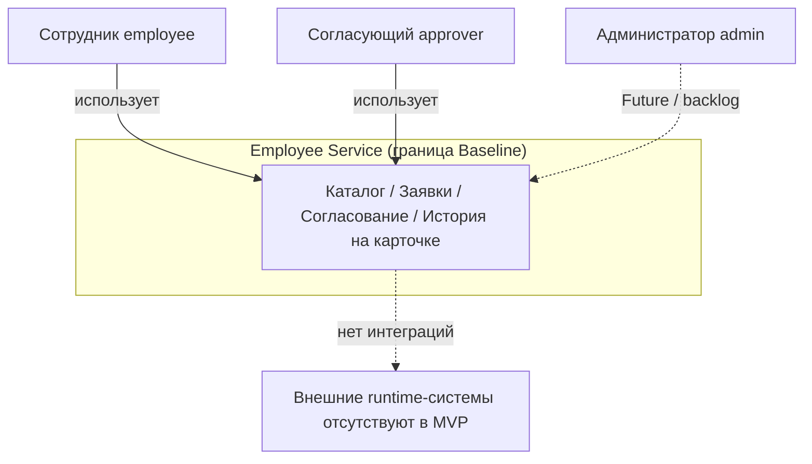

# ARCH-CTX — Context Diagram (граница системы)

**Продукт:** Employee Service  
**ID:** ARCH-CTX  
**Версия:** 1.1  
**Статус:** Baseline v1.0  
**Связанные документы:** [architecture-description.md](./architecture-description.md), [Vision](../../01-vision-and-scope/vision-scope.md), [ADR-AUTH-DEMO-01](./adr-demo-role-header.md), [ADR-UI-01](./adr-static-web-client.md)

---

## 1. Назначение

Показать границу MVP Employee Service, актёров и отсутствие внешних runtime-зависимостей, уже исключённых Vision / Stage 2.

---

## 2. Система и актёры

| Участник | Тип | Смысл | Scope |
| :--- | :--- | :--- | :--- |
| **Employee Service** | Система | Каталог, заявки, согласование, история на карточке; UI — static HTML/JS | Baseline |
| **Сотрудник** (`employee`) | Актёр | Инициатор заявок, мои заявки, создание, карточка | Baseline |
| **Согласующий** (`approver`) | Актёр | Очередь задач, approve / reject / return | Baseline |
| **Администратор** (`admin`) | Актёр | Конфигурация типов/маршрутов, реестр | **Future / backlog** |

Один пользователь может совмещать роли (union permissions, BR-16). В Baseline переключение актёра — экран выбора роли + заголовок ([ADR-AUTH-DEMO-01](./adr-demo-role-header.md)), без login/password + JWT.

---

## 3. Внешние системы

**В MVP runtime-интеграций нет** (требование / out of scope Vision):

| Не используется | Основание |
| :--- | :--- |
| SSO / AD / LDAP | Out of scope |
| Email / push | BR-11 — только in-app (уведомления — backlog) |
| Внешний BPM (Camunda и аналоги) | Out of scope; встроенный Approval Engine |
| Оргструктура / auto-routing руководителя | BR-12, out of scope |
| HRIS / payroll | Out of scope |

OpenAPI — артефакт документации (контракт API), не внешняя runtime-система.

---

## 4. Диаграмма (Mermaid)

---

## 5. Что внутри границы (обзор)

**Baseline:**

1. Демо-идентичность: роль через заголовок + экран выбора роли (Vision §12 п.7; ADR-AUTH-DEMO-01). Login/password + JWT — [backlog](../../backlog.md).
2. Лёгкий веб-клиент: static HTML+JS от FastAPI, пять экранов (Vision §12 п.8; ADR-UI-01).
3. Каталог активных типов и формы (FR-CAT-*).
4. Жизненный цикл заявки и RouteInstance / FieldValueVersion (FR-REQ-*, BR-08/22/26).
5. Последовательное согласование (FR-APP-*, BR-02…05, BR-21, BR-25).
6. История решений и статусов на карточке (FR-AUDIT-*, BR-24).

**Future / backlog** (Vision §12 п.9): admin-конфигурация, in-app уведомления, профиль, полноценная auth.

Детализация контейнеров — [container-diagram.md](./container-diagram.md).

---

## 6. Трассировка

| Тип | ID |
| :--- | :--- |
| **UC** | UC ядра Baseline; UC-01/02/11–13/15 — backlog |
| **FR** | CAT / REQ / APP / AUDIT (Baseline); AUTH / CAB / NOTIF / ADMIN — backlog |
| **BR** | BR ядра; BR-11/12/13/23/27/29 — по scope / backlog |
| **Vision** | Scope §6, Out of scope §7, §12 |
| **UML** | UML-UC-01 |

---

## 7. Границы

- Не показываются HTTP-эндпоинты и таблицы БД.
- Не добавляются внешние системы «на будущее».
- Новые актёры и роли не вводятся.
