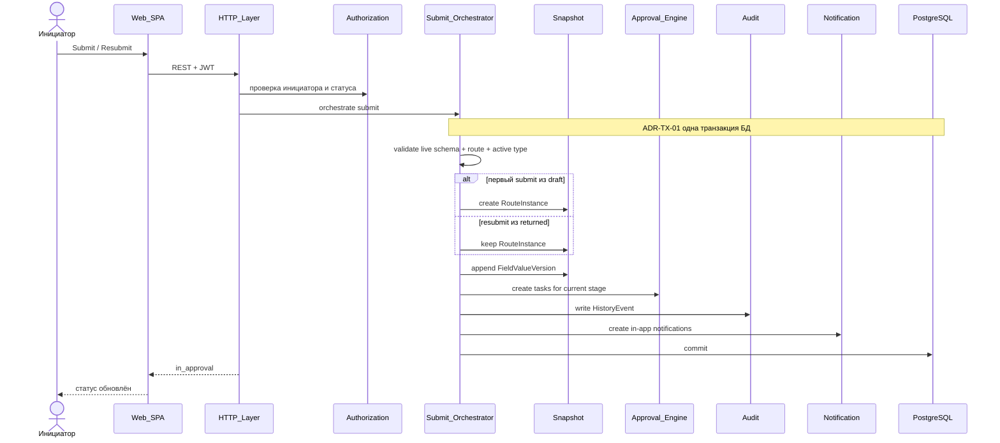
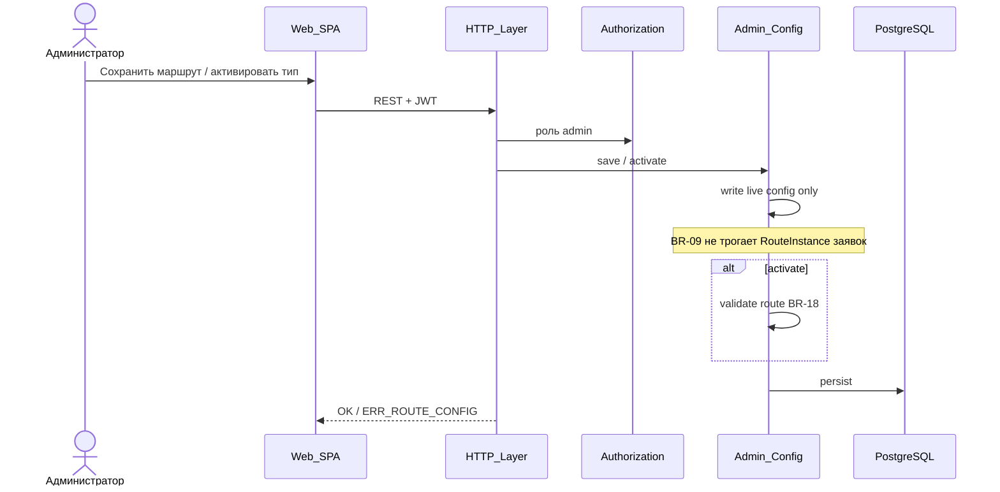

# ARCH-FLOW — Основные потоки данных и взаимодействия

**Продукт:** Employee Service  
**ID:** ARCH-FLOW  
**Версия:** 1.0  
**Статус:** Baseline v1.0  
**Связанные документы:** [architecture-description.md](./architecture-description.md), [Snapshot Model](../erd/snapshot-model.md)

---

## 1. Назначение

Показать, как контейнеры и логические модули взаимодействуют в ключевых сценариях, уже описанных BPMN-01…03 и UML-SEQ-01…03. Порядок бизнес-правил **не меняется**; добавляется только архитектурная раскладка.

Транзакционные границы ниже — **ADR-детализация** поверх уже требуемой атомарности (BR-29, NFR-REL-01). Они не создают новых FR/BR/NFR.

---

## 2. Поток A — Первый submit и resubmit (UC-05)

**Требования:** BR-08, BR-18, BR-20, BR-22, BR-23, BR-24, BR-26, BR-29; FR-REQ-03/09; FR-NOTIF-01; FR-AUDIT-02.

### 2.1. Шаги (логический)

1. HTTP Layer принимает команду submit; AuthN (JWT); AuthZ (инициатор, статус `draft`|`returned`).
2. Request / Catalog: валидация полей по **актуальной** схеме; проверка типа активен; валидация маршрута (BR-18).
3. **Submit Orchestrator** открывает транзакцию БД (**ADR-TX-01**):
   - если первый submit (`draft`) → Snapshot: **создать** RouteInstance (BR-08);
   - если resubmit (`returned`) → Snapshot: **не** rebuild RouteInstance (BR-22);
   - Snapshot: **новая** FieldValueVersion (BR-26; канон — [Snapshot Model](../erd/snapshot-model.md));
   - статус → `in_approval`; создать ApprovalTask текущего этапа по RouteInstance;
   - Audit: событие submit/resubmit (+ связь с версией значений, BR-24);
   - Notification: если в scope (иначе backlog).
4. Commit. Ошибка Audit/Snapshot (и Notification при наличии) → rollback.

### 2.2. Sequence (Mermaid)



---

## 3. Поток B — Approve / Reject / Return (UC-07…09)

**Требования:** BR-03, BR-04, BR-05, BR-14, BR-15, BR-17, BR-21, BR-25, BR-29; FR-APP-*; FR-NOTIF-01; FR-AUDIT-02.

### 3.1. Шаги

1. AuthN; AuthZ: своя **open** задача (BR-15); actor ≠ initiator (BR-21); иначе `ERR_FORBIDDEN_APPROVAL`.
2. Approval Engine:
   - reject/return → непустой комментарий (BR-25) иначе `ERR_VALIDATION`;
   - approve → комментарий опционален.
3. Транзакция (**ADR-TX-02**):
   - **Approve:** задача completed; sibling open → `cancelled` (BR-03); читать RouteInstance (не live config); next tasks или `approved` (BR-17);
   - **Reject:** `rejected`; закрыть open задачи этапа (BR-04);
   - **Return:** `returned`; сохранить номер этапа; закрыть задачи этапа (BR-05);
   - Audit + Notification в той же TX (BR-29).
4. Повтор по уже закрытой/cancelled задаче → `ERR_TASK_DONE` / `ERR_DUP_ACTION` (NFR-REL-02) без повторной мутации.

### 3.2. Sequence: approve + first-approve (Mermaid)

```mermaid
sequenceDiagram
  actor A as Согласующий_A
  participant Web as Web_SPA
  participant API as HTTP_Layer
  participant AuthZ as Authorization
  participant Eng as Approval_Engine
  participant Snap as Snapshot
  participant Aud as Audit
  participant Ntf as Notification
  participant DB as PostgreSQL

  A->>Web: Approve
  Web->>API: REST + JWT
  API->>AuthZ: own open task; not initiator
  API->>Eng: approve
  Note over Eng,DB: ADR-TX-02 одна транзакция
  Eng->>Eng: complete task A; cancel sibling open tasks
  Eng->>Snap: read RouteInstance next step
  alt есть следующий этап
    Eng->>Eng: create next stage tasks
  else последний этап
    Eng->>Eng: status = approved
  end
  Eng->>Aud: HistoryEvent
  Eng->>Ntf: in-app notifications
  Eng->>DB: commit
  API-->>Web: OK
```

---

## 4. Поток C — Admin configure (UC-11, UC-12)

**Требования:** BR-09, BR-10, BR-12, BR-18, BR-27; FR-ADMIN-01…06.

1. AuthZ: роль `admin` (ACL-04); admin не создаёт заявки за сотрудников (BR-27).
2. Admin Config пишет **live** конфигурацию (тип, поля, этапы, назначения, справочники).
3. **Snapshot isolation (BR-09):** запись конфига **не** изменяет существующие RouteInstance in-flight заявок.
4. Activate: валидация маршрута (BR-18); иначе тип остаётся неактивным.
5. Deactivate: скрытие из каталога (BR-10); in-flight продолжают по своим snapshot.
6. Audit конфигурационных изменений — по мере наличия событий в BR-24 / admin history FR-ADMIN-08 (без расширения набора обязательных событий сверх Stage 2).



---

## 5. Поток D — Чтение: списки, карточка, история, уведомления

| Сценарий | Модули | Правила видимости |
| :--- | :--- | :--- |
| Свои заявки | Request + AuthZ | BR-01 |
| Очередь задач | Approval Engine + AuthZ | BR-14, BR-15 |
| Реестр admin | Admin / Request + AuthZ | BR-13 |
| История | Audit + AuthZ | FR-AUDIT-01; visibility как у заявки |
| Уведомления | Notification + AuthZ | только получатель; FR-NOTIF-02/03 |

Пагинация списков — NFR-PERF-03 (default 20 / max 100).

Чужой скрываемый ресурс для employee → `ERR_NOT_FOUND` / 404 (NFR-SEC-05).

---

## 6. Сводка транзакционных границ (ADR)

| ID | Граница | Что атомарно | Источник требования |
| :--- | :--- | :--- | :--- |
| **ADR-TX-01** | Submit / resubmit | status + snapshots + tasks + audit + notifications | BR-29, NFR-REL-01, BR-20 |
| **ADR-TX-02** | Approve / reject / return | status/tasks (вкл. first-approve cancel) + audit + notifications | BR-03/04/05, BR-29, NFR-REL-01 |
| **ADR-TX-03** | Cancel | status + audit (+ notification инициатору при наличии в BR-23) | BR-07, BR-24, BR-23 |
| **ADR-TX-04** | Admin save/activate | запись live config; **без** мутации RouteInstance заявок | BR-09 |

Детализация «один DB transaction на use case» — **предположение MVP** о реализации атомарности, уже требуемой NFR/BR. Альтернативы (outbox и т.п.) не вводятся в MVP.

---

## 7. Трассировка

| Поток | UC | BPMN | UML |
| :--- | :--- | :--- | :--- |
| A | UC-04, UC-05, UC-10 | BPMN-01 | UML-SEQ-01, UML-SM-01 |
| B | UC-07, UC-08, UC-09 | BPMN-02 | UML-SEQ-02, UML-SM-01 |
| C | UC-11, UC-12 | BPMN-03 | UML-SEQ-03 |
| D | UC-06, UC-13, UC-14, UC-15 | — (вне отдельных BPMN) | UML-UC-01 |

---

## 8. Границы

- Нет HTTP path / OpenAPI.
- Нет диаграмм физической репликации БД.
- Порядок правил совпадает с Stage 2 / 3.1 / 3.2.
