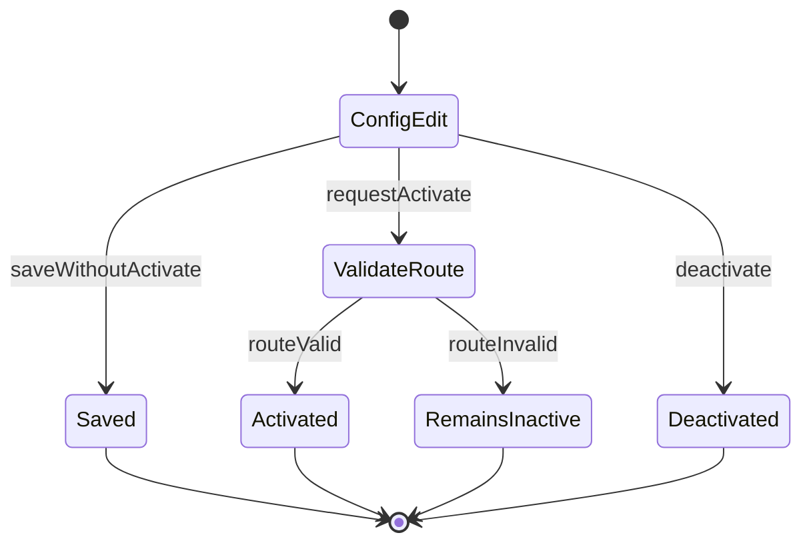

# BPMN-03 — Настройка типа заявки и маршрута (TO-BE)

**Продукт:** Employee Service  
**ID:** BPMN-03  
**Версия:** 1.0  
**Статус:** Future  
**Связанные документы:** [bpmn-description.md](./bpmn-description.md), [Backlog](../../backlog.md)

---

## 1. Назначение

> **Статус Future:** admin-конфигурация вне MVP Baseline. Полные требования — [docs/backlog.md](../../backlog.md). Файл сохранён для будущего развития, не удалять.

TO-BE процесс конфигурации администратором: тип заявки, поля формы, последовательный маршрут, этапы, назначения; активация / деактивация типа.

Процесс не создаёт заявки от имени сотрудника (BR-27). Изменения live-конфигурации **могут затронуть** in-flight заявки ([ADR-LIVE-CFG-01](../architecture/adr-live-config.md)); рекомендуется не удалять этап с open tasks (BR-09).

---

## 2. Pool и Lane

| Элемент | Имя | Роль / назначение |
| :--- | :--- | :--- |
| **Pool** | Employee Service — админ-конфигурация | Граница процесса настройки |
| **Lane** | Администратор | Роль `admin` |
| **Lane** | Система | Валидация маршрута, сохранение live config, guard опасных правок (BR-09) |

RBAC: операции конфигурации — только `admin` (ACL-04 — backlog; не определён в Baseline rbac-matrix). Создание заявок ролью `admin` без `employee` недоступно (ACL-09 — backlog, BR-27). См. [consistency-review.md](../../consistency-review.md) RR-ACL-01.

---

## 3. Каталог элементов BPMN 2.0

### 3.1. Events

| ID | Тип | Lane | Описание |
| :--- | :--- | :--- | :--- |
| SE-01 | Start Event | Администратор | Admin открывает раздел конфигурации типов / маршрутов |
| EE-01 | End Event | Система | Конфигурация сохранена (тип активен или неактивен по итогу) |
| EE-02 | End Event | Система | Активация отклонена: маршрут невалиден; тип остаётся неактивным |
| EE-03 | End Event | Администратор | Операция отклонена: нет прав admin |

### 3.2. User Tasks

| ID | Lane | Название | Описание |
| :--- | :--- | :--- | :--- |
| UT-01 | Администратор | Создать / изменить тип заявки | Имя, описание, признак `is_active` (FR-ADMIN-01) |
| UT-02 | Администратор | Настроить поля формы типа | CRUD полей: код, название, тип, обязательность, порядок, справочник (FR-ADMIN-02) |
| UT-03 | Администратор | Настроить маршрут | Связь типа с маршрутом (FR-ADMIN-03) |
| UT-04 | Администратор | Настроить этапы и порядок | CRUD этапов, sequence (FR-ADMIN-04); маршрут последовательный (BR-02) |
| UT-05 | Администратор | Назначить согласующих на этап | Явно роль и/или пользователь; без оргструктурного auto-routing (BR-12, FR-ADMIN-05) |
| UT-06 | Администратор | Запросить активацию типа | Установка `is_active = true` |
| UT-07 | Администратор | Деактивировать тип | `is_active = false` (BR-10) |
| UT-08 | Администратор | Управлять справочниками | Краткий боковой шаг CRUD справочников (FR-ADMIN-06); без отдельной диаграммы |

### 3.3. Service Tasks

| ID | Lane | Название | Описание |
| :--- | :--- | :--- | :--- |
| ST-01 | Система | Проверить роль admin | Доступ к конфигурации (ACL-04 — backlog) |
| ST-02 | Система | Сохранить тип / поля / маршрут / этапы / назначения | Персистенция конфигурации |
| ST-03 | Система | Валидировать маршрут для активации | ≥1 этап; у каждого этапа ≥1 назначение (BR-18) |
| ST-04 | Система | Установить is_active = true | Только после успешной валидации маршрута |
| ST-05 | Система | Установить is_active = false | Тип скрывается из каталога; уже запущенные заявки продолжают согласование (BR-10, BR-09) |
| ST-06 | Система | In-flight guard | Проверка BR-09: блок/предупреждение при удалении этапа с open tasks; caveat ADR-LIVE-CFG-01 для in-flight |

### 3.4. Exclusive Gateways

| ID | Lane | Название | Исходящие пути |
| :--- | :--- | :--- | :--- |
| GW-01 | Система | Пользователь admin? | Да → GW-02; Нет → EE-03 |
| GW-02 | Администратор | Цель изменения | Тип/поля → UT-01/UT-02; Маршрут/этапы/назначения → UT-03…UT-05; Активация → UT-06; Деактивация → UT-07; Справочники → UT-08 |
| GW-03 | Система | Маршрут валиден для активации? | Да → ST-04 → EE-01; Нет → EE-02 |

---

## 4. Sequence Flow

| ID | From → To | Условие / примечание |
| :--- | :--- | :--- |
| SF-01 | SE-01 → ST-01 | Проверка прав |
| SF-02 | ST-01 → GW-01 | — |
| SF-03 | GW-01 → GW-02 | Роль admin |
| SF-04 | GW-01 → EE-03 | ERR_FORBIDDEN |
| SF-05 | GW-02 → UT-01 | Работа с типом |
| SF-06 | GW-02 → UT-02 | Работа с полями |
| SF-07 | GW-02 → UT-03 | Работа с маршрутом |
| SF-08 | UT-03 → UT-04 | Этапы |
| SF-09 | UT-04 → UT-05 | Назначения |
| SF-10 | GW-02 → UT-06 | Активация |
| SF-11 | GW-02 → UT-07 | Деактивация |
| SF-12 | GW-02 → UT-08 | Справочники |
| SF-13 | UT-01 → ST-02 | Сохранение типа |
| SF-14 | UT-02 → ST-02 | Сохранение полей |
| SF-15 | UT-05 → ST-02 | Сохранение маршрута/этапов/назначений |
| SF-16 | UT-08 → ST-02 | Сохранение справочников |
| SF-17 | ST-02 → ST-06 | In-flight guard (BR-09, ADR-LIVE-CFG-01) |
| SF-18 | ST-06 → EE-01 | Конфиг сохранён без обязательной активации |
| SF-19 | UT-06 → ST-03 | Проверка маршрута перед активацией |
| SF-20 | ST-03 → GW-03 | — |
| SF-21 | GW-03 → ST-04 | Маршрут валиден |
| SF-22 | ST-04 → ST-06 | — |
| SF-23 | ST-06 → EE-01 | Тип активен |
| SF-24 | GW-03 → EE-02 | ERR_ROUTE_CONFIG / ERR_VALIDATION; тип не активен |
| SF-25 | UT-07 → ST-05 | Деактивация |
| SF-26 | ST-05 → ST-06 | Запущенные заявки не останавливаются |
| SF-27 | ST-06 → EE-01 | Тип неактивен в каталоге |

Типичный полный сценарий подготовки типа: UT-01 → UT-02 → UT-03 → UT-04 → UT-05 → ST-02 → (опционально) UT-06 → ST-03 → активация.

---

## 5. Message Flow

Между admin и внешними участниками Message Flow для уведомлений **не требуется**: конфигурация не порождает обязательных in-app уведомлений по BR-23 (события BR-23 относятся к задачам согласования и статусам заявок).

При необходимости информирования admin работает в рамках своего UI; отдельный Message Flow в BPMN-03 не моделируется.

---

## 6. Связь live config и runtime (аннотации)

| Тема | Поведение | Где видно |
| :--- | :--- | :--- |
| Live route | Submit и approve читают актуальный ApprovalRoute/Stage (BR-08) | BPMN-01 ST-04/05 |
| In-flight caveat | Правки конфига **могут** затронуть незавершённые заявки (ADR-LIVE-CFG-01) | UML-SEQ-03 |
| Schema при edit | Актуальная live-схема в draft/returned (BR-26) | BPMN-01 UT-02 |
| Деактивация типа | Тип скрыт; in-flight продолжают (BR-10) | AC-CAT-01b |

---

## 7. Текстовое описание потока

1. **SE-01 / ST-01** — только `admin`.
2. Admin настраивает тип, поля, маршрут (последовательные этапы), явные назначения.
3. Сохранение live-конфигурации с учётом BR-09 / ADR-LIVE-CFG-01 (caveat in-flight).
4. Активация возможна только при валидном маршруте (BR-18).
5. Деактивация убирает тип из каталога; живые заявки не прерываются.

---

## 8. Дополнительная схема логики активации (не замена BPMN)

Справочно. **Не** заменяет таблицы §3–§4.

---

## 9. Трассировка

| Тип | ID |
| :--- | :--- |
| **UC** | UC-11, UC-12 |
| **FR** | FR-ADMIN-01, FR-ADMIN-02, FR-ADMIN-03, FR-ADMIN-04, FR-ADMIN-05; FR-ADMIN-06 (кратко, UT-08) |
| **BR** | BR-02, BR-08, BR-09, BR-10, BR-12, BR-18, BR-26, BR-27 |
| **AC** | AC-ADMIN-01, AC-APP-10, AC-APP-10b, AC-CAT-01, AC-CAT-01b, AC-DRAFT-01 |
| **RBAC/ACL** | только `admin`; ACL-04, ACL-09 — backlog; не определены в Baseline rbac-matrix |

---

## 10. Границы

- Реестр заявок и просмотр истории admin (UC-15, FR-ADMIN-07/08) — не отдельный BPMN-процесс.
- Runtime согласования — BPMN-01 / BPMN-02.
- Новые бизнес-правила не вводятся; scope требований не расширяется.
