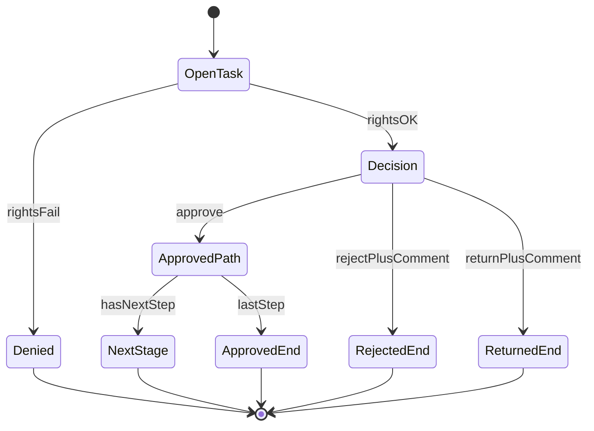

# BPMN-02 — Обработка этапа согласования (TO-BE)

**Продукт:** Employee Service  
**ID:** BPMN-02  
**Версия:** 1.0  
**Статус:** Baseline v1.0  
**Связанные документы:** [bpmn-description.md](./bpmn-description.md), [BPMN-01](./to-be-request-lifecycle.md)

---

## 1. Назначение

TO-BE обработка текущего этапа согласования по открытой задаче assignee: решения approve, reject, return; правило first-approve wins; переход к следующему этапу или завершение маршрута.

Маршрут строго последовательный (BR-02). Параллельные этапы в MVP не используются.

---

## 2. Pool и Lane

| Элемент | Имя | Роль / назначение |
| :--- | :--- | :--- |
| **Pool** | Employee Service — этап согласования | Подпроцесс обработки этапа |
| **Lane** | Согласующий | Роль `approver`, assignee открытой задачи |
| **Lane** | Система | Закрытие задач, смена статуса, создание задач следующего этапа, уведомления, история |

Охраняющие условия (без новых правил): BR-15 (только своя открытая задача), BR-21 (запрет самосогласования), ACL-02, ACL-03, ACL-07.

---

## 3. Каталог элементов BPMN 2.0

### 3.1. Events

| ID | Тип | Lane | Описание |
| :--- | :--- | :--- | :--- |
| SE-01 | Start Event | Согласующий | Есть открытая задача на текущем этапе; согласующий приступает к обработке |
| EE-01 | End Event | Система | Этап пройден; созданы задачи следующего этапа (заявка остаётся `in_approval`) |
| EE-02 | End Event | Система | Маршрут завершён: статус `approved` |
| EE-03 | End Event | Система | Маршрут завершён: статус `rejected` |
| EE-04 | End Event | Система | Заявка возвращена: статус `returned`; номер этапа сохранён |
| EE-05 | End Event | Согласующий | Действие отклонено (нет прав / задача не открыта / самосогласование / пустой комментарий при reject/return) |

### 3.2. User Tasks

| ID | Lane | Название | Описание |
| :--- | :--- | :--- | :--- |
| UT-01 | Согласующий | Открыть задачу и карточку заявки | Полная карточка заявки по своей задаче (BR-14) |
| UT-02 | Согласующий | Approve | Согласовать этап; комментарий необязателен (BR-25) |
| UT-03 | Согласующий | Reject | Отклонить заявку; комментарий обязателен (BR-25) |
| UT-04 | Согласующий | Return | Вернуть на доработку; комментарий обязателен (BR-25) |

### 3.3. Service Tasks

| ID | Lane | Название | Описание |
| :--- | :--- | :--- | :--- |
| ST-01 | Система | Проверить право на действие | Задача принадлежит actor и открыта; actor ≠ инициатор (BR-15, BR-21) |
| ST-02 | Система | Проверить обязательность комментария | Для reject/return — непустой комментарий (BR-25); для approve — не требуется |
| ST-03 | Система | Завершить задачу approve | Задача actor → completed |
| ST-04 | Система | First-approve wins: отменить прочие задачи этапа | Остальные **активные** задачи этапа → `cancelled` (BR-03) |
| ST-05 | Система | Определить следующий этап по route snapshot | Чтение **существующего** route snapshot заявки (не пересоздание) |
| ST-06 | Система | Создать задачи следующего этапа | Назначения из route snapshot (BR-02, FR-APP-06) |
| ST-07 | Система | Установить статус approved | Approve на последнем этапе (BR-17) |
| ST-08 | Система | Установить статус rejected | Закрыть открытые задачи текущего этапа (BR-04) |
| ST-09 | Система | Установить статус returned | Сохранить номер текущего этапа; закрыть открытые задачи этапа (BR-05) |
| ST-10 | Система | Записать событие в историю | Approve / reject / return / переход этапа (BR-24) |
| ST-11 | Система | Создать in-app уведомления | В одной транзакции с событием (BR-23, BR-29) |

### 3.4. Exclusive Gateways

| ID | Lane | Название | Исходящие пути |
| :--- | :--- | :--- | :--- |
| GW-01 | Система | Действие разрешено? | Да → GW-02; Нет → EE-05 |
| GW-02 | Согласующий | Выбор решения | Approve → UT-02; Reject → UT-03; Return → UT-04 |
| GW-03 | Система | Комментарий корректен? | Да → продолжение ветки; Нет → EE-05 (ERR_VALIDATION) |
| GW-04 | Система | Есть следующий этап в route snapshot? | Да → ST-06 → EE-01; Нет → ST-07 → EE-02 |

---

## 4. Sequence Flow

| ID | From → To | Условие / примечание |
| :--- | :--- | :--- |
| SF-01 | SE-01 → UT-01 | Открытие задачи |
| SF-02 | UT-01 → ST-01 | Перед решением — проверка прав |
| SF-03 | ST-01 → GW-01 | — |
| SF-04 | GW-01 → GW-02 | Права OK |
| SF-05 | GW-01 → EE-05 | ERR_FORBIDDEN_APPROVAL / ERR_TASK_DONE / ERR_DUP_ACTION |
| SF-06 | GW-02 → UT-02 | Approve |
| SF-07 | GW-02 → UT-03 | Reject |
| SF-08 | GW-02 → UT-04 | Return |
| SF-09 | UT-02 → ST-02 | Комментарий опционален → проверка всегда проходит для approve |
| SF-10 | UT-03 → ST-02 | Обязательный комментарий |
| SF-11 | UT-04 → ST-02 | Обязательный комментарий |
| SF-12 | ST-02 → GW-03 | — |
| SF-13 | GW-03 → EE-05 | Пустой комментарий при reject/return |
| SF-14 | GW-03 → ST-03 | Ветка Approve: OK |
| SF-15 | ST-03 → ST-04 | First-approve wins |
| SF-16 | ST-04 → ST-05 | Определить next step по **route snapshot** |
| SF-17 | ST-05 → GW-04 | — |
| SF-18 | GW-04 → ST-06 | Есть следующий этап |
| SF-19 | ST-06 → ST-10 | История перехода |
| SF-20 | ST-10 → ST-11 | Уведомления assignees следующего этапа |
| SF-21 | ST-11 → EE-01 | Конец подпроцесса: next stage |
| SF-22 | GW-04 → ST-07 | Последний этап |
| SF-23 | ST-07 → ST-10 | История завершения |
| SF-24 | ST-10 → ST-11 | Уведомление инициатору |
| SF-25 | ST-11 → EE-02 | Конец: `approved` |
| SF-26 | GW-03 → ST-08 | Ветка Reject: комментарий OK |
| SF-27 | ST-08 → ST-10 | История reject |
| SF-28 | ST-10 → ST-11 | Уведомление инициатору |
| SF-29 | ST-11 → EE-03 | Конец: `rejected` |
| SF-30 | GW-03 → ST-09 | Ветка Return: комментарий OK |
| SF-31 | ST-09 → ST-10 | История return |
| SF-32 | ST-10 → ST-11 | Уведомление инициатору |
| SF-33 | ST-11 → EE-04 | Конец: `returned` |

Примечание по GW-03: после ST-02 шлюз ветвит по типу решения (approve / reject / return) и корректности комментария; при ошибке комментария — EE-05 без изменения статуса заявки.

---

## 5. Message Flow

| ID | From → To | Сообщение | Правило |
| :--- | :--- | :--- | :--- |
| MF-01 | Система → Согласующий(ие) | Уведомление о задачах следующего этапа | После ST-06 / ST-11; BR-23, BR-29 |
| MF-02 | Система → Инициатор | Уведомление о approve этапа / approved / rejected / returned | BR-23, BR-29 |

Только in-app (BR-11).

---

## 6. Текстовое описание потока

1. **SE-01** — согласующий открывает свою открытую задачу (**UT-01**, полная карточка — BR-14).
2. **ST-01 / GW-01** — проверка assignee и запрет самосогласования.
3. **GW-02** — выбор Approve / Reject / Return.
4. **Approve:** опциональный комментарий → задача completed → прочие активные задачи этапа `cancelled` (BR-03) → по **route snapshot** либо задачи следующего этапа, либо `approved` (BR-17).
5. **Reject:** обязательный комментарий → `rejected`, маршрут завершён (BR-04).
6. **Return:** обязательный комментарий → `returned`, номер этапа сохранён, задачи этапа закрыты (BR-05); дальнейший resubmit — в BPMN-01 с тем же route snapshot.

Route snapshot в этом процессе **только читается**, не создаётся и не пересоздаётся.

---

## 7. Дополнительная схема логики решения (не замена BPMN)

Справочная развилка решений на этапе. **Не** заменяет таблицы элементов §3–§4.

---

## 8. Трассировка

| Тип | ID |
| :--- | :--- |
| **UC** | UC-07, UC-08, UC-09 |
| **FR** | FR-APP-01, FR-APP-02, FR-APP-03, FR-APP-04, FR-APP-05, FR-APP-06, FR-APP-07; FR-REQ-08; FR-NOTIF-01; FR-AUDIT-02 |
| **BR** | BR-02, BR-03, BR-04, BR-05, BR-14, BR-15, BR-17, BR-21, BR-25, BR-29 |
| **AC** | AC-APP-04, AC-APP-04b, AC-APP-05, AC-APP-05b, AC-APP-06, AC-APP-06b, AC-APP-07, AC-APP-07b, AC-APP-09, AC-ACC-02, AC-ACC-03, AC-ACC-06 |
| **RBAC/ACL** | ACL-02, ACL-03, ACL-07 |

---

## 9. Границы

- Создание заявки, первый/повторный submit, cancel — BPMN-01.
- Настройка маршрута администратором — BPMN-03.
- Новые правила не вводятся; auto-routing по оргструктуре отсутствует (BR-12 относится к конфигурации в BPMN-03).
