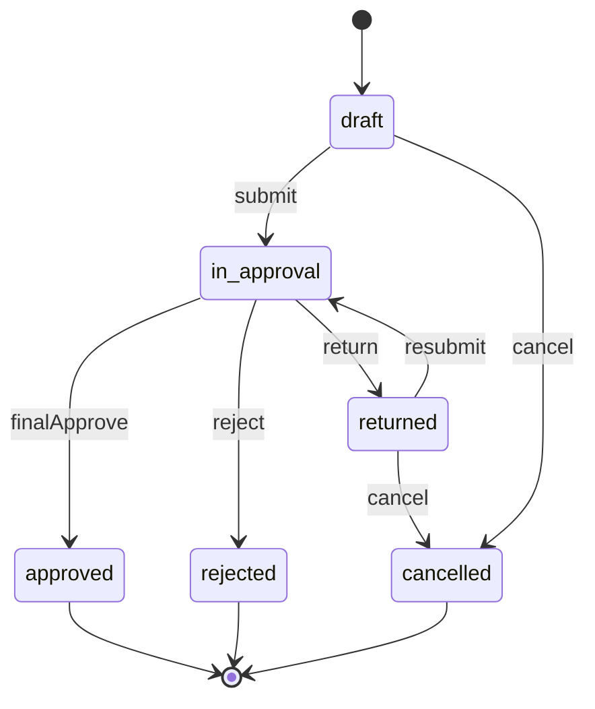

# BPMN-01 — Жизненный цикл заявки (TO-BE)

**Продукт:** Employee Service  
**ID:** BPMN-01  
**Версия:** 1.0  
**Статус:** Baseline v1.0  
**Связанные документы:** [bpmn-description.md](./bpmn-description.md), [Snapshot Model](../erd/snapshot-model.md), [UML-SM-01](../uml/state-request.md)

---

## 1. Назначение

TO-BE процесс прохождения кадровой заявки от создания до терминального статуса: `approved`, `rejected` или `cancelled`, включая return и повторный submit.

---

## 2. Pool и Lane

| Элемент | Имя | Роль / назначение |
| :--- | :--- | :--- |
| **Pool** | Employee Service | Граница процесса сервиса заявок |
| **Lane** | Инициатор | Роль `employee`, владелец заявки |
| **Lane** | Согласующий | Роль `approver` (участник через Call Activity BPMN-02) |
| **Lane** | Система | Автоматические Service Task; доставка уведомлений — **Future / backlog** |

RBAC: создание / edit / submit / cancel — только инициатор с ролью `employee` (матрица RBAC; BR-27 / ACL-09 — admin сам по себе заявки не создаёт).

---

## 3. Snapshot (кратко)

Канон: [Snapshot Model](../erd/snapshot-model.md) (вариант B).

| Вид | BPMN-отражение | Правило |
| :--- | :--- | :--- |
| **RouteInstance** | ST-04 | Создаётся только при первом submit (BR-08); при resubmit не rebuild (BR-22) |
| **FieldValueVersion** | ST-05 | Новая версия на каждый successful submit (BR-26) |

---

## 4. Каталог элементов BPMN 2.0

### 4.1. Events

| ID | Тип | Lane | Описание |
| :--- | :--- | :--- | :--- |
| SE-01 | Start Event | Инициатор | Инициатор начинает создание заявки выбранного активного типа |
| EE-01 | End Event | Система | Заявка в статусе `approved` |
| EE-02 | End Event | Система | Заявка в статусе `rejected` |
| EE-03 | End Event | Система | Заявка в статусе `cancelled` |
| EE-04 | End Event | Инициатор | Submit отклонён (валидация / маршрут / состояние); статус не меняется |

### 4.2. User Tasks

| ID | Lane | Название | Описание |
| :--- | :--- | :--- | :--- |
| UT-01 | Инициатор | Создать заявку | Создание заявки; статус `draft`; инициатор = текущий пользователь |
| UT-02 | Инициатор | Заполнить / изменить поля | Редактирование полей по **актуальной** схеме типа; допустимо в `draft` и `returned` |
| UT-03 | Инициатор | Отправить (submit) | Первый submit из `draft` или повторный из `returned` |
| UT-04 | Инициатор | Отменить заявку | Cancel только из `draft` или `returned` |
| UT-05 | Инициатор | Доработать после return | Редактирование полей в `returned` перед resubmit (тот же UT-02 по смыслу) |

### 4.3. Service Tasks

| ID | Lane | Название | Описание |
| :--- | :--- | :--- | :--- |
| ST-01 | Система | Валидировать поля по актуальной схеме | Проверка значений перед submit (BR-26) |
| ST-02 | Система | Проверить маршрут и активность типа | Валидность маршрута (BR-18); тип активен |
| ST-03 | Система | Определить вид submit | Первый (`draft`) или повторный (`returned`) |
| ST-04 | Система | Создать RouteInstance | **Только** при первом submit (BR-08); см. [Snapshot Model](../erd/snapshot-model.md) |
| ST-05 | Система | Создать FieldValueVersion | При **каждом** успешном submit (BR-26) |
| ST-06 | Система | Установить статус in_approval | BR-20 |
| ST-07 | Система | Создать задачи текущего этапа | Всегда задачи этапа 1 при (re)submit: первый submit или resubmit после return (BR-06, BR-22); RouteInstance без rebuild |
| ST-08 | Система | Записать событие в историю | BR-24 |
| ST-09 | Система | Создать in-app уведомления | **Future / backlog** (BR-23, BR-29); в одной транзакции с бизнес-событием, когда модуль в scope |
| ST-10 | Система | Установить статус cancelled | После успешного cancel (BR-07) |

### 4.4. Call Activity

| ID | Lane | Название | Описание |
| :--- | :--- | :--- | :--- |
| CA-01 | Согласующий / Система | Обработка этапа согласования | Вызов BPMN-02; результат: next stage / approved / rejected / returned |

### 4.5. Exclusive Gateways

| ID | Lane | Название | Исходящие пути |
| :--- | :--- | :--- | :--- |
| GW-01 | Система | Submit допустим? | Да → ST-01; Нет (неверный статус) → EE-04 |
| GW-02 | Система | Валидация полей OK? | Да → ST-02; Нет → EE-04 |
| GW-03 | Система | Маршрут валиден и тип активен? | Да → ST-03; Нет → EE-04 |
| GW-04 | Система | Первый submit? | Да (`draft`) → ST-04 затем ST-05; Нет (`returned`) → **пропуск ST-04**, сразу ST-05 |
| GW-05 | Инициатор | Действие в draft/returned | Submit → UT-03; Cancel → UT-04; Edit → UT-02 |
| GW-06 | Система | Результат этапа (после CA-01) | Approved → EE-01; Rejected → EE-02; Returned → UT-05; Next stage → CA-01 (повтор) |
| GW-07 | Система | Cancel допустим? | Да (`draft`/`returned`) → ST-10; Нет → EE-04 (статус без изменений) |

---

## 5. Sequence Flow (основной порядок)

| ID | From → To | Условие / примечание |
| :--- | :--- | :--- |
| SF-01 | SE-01 → UT-01 | Старт создания |
| SF-02 | UT-01 → UT-02 | Заявка в `draft`; история создания (ST-08 по событию) |
| SF-03 | UT-02 → GW-05 | Инициатор выбирает submit / cancel / продолжить edit |
| SF-04 | GW-05 → UT-03 | Submit |
| SF-05 | GW-05 → UT-04 | Cancel |
| SF-06 | GW-05 → UT-02 | Продолжить заполнение |
| SF-07 | UT-03 → GW-01 | Проверка допустимости submit |
| SF-08 | GW-01 → ST-01 | Статус `draft` или `returned` |
| SF-09 | GW-01 → EE-04 | Иной статус |
| SF-10 | ST-01 → GW-02 | — |
| SF-11 | GW-02 → ST-02 | Поля валидны |
| SF-12 | GW-02 → EE-04 | ERR_VALIDATION |
| SF-13 | ST-02 → GW-03 | — |
| SF-14 | GW-03 → ST-03 | Маршрут OK, тип активен |
| SF-15 | GW-03 → EE-04 | ERR_ROUTE_CONFIG / ERR_INACTIVE_TYPE |
| SF-16 | ST-03 → GW-04 | — |
| SF-17 | GW-04 → ST-04 | Первый submit: создать **RouteInstance** |
| SF-18 | ST-04 → ST-05 | Затем **FieldValueVersion** |
| SF-19 | GW-04 → ST-05 | Resubmit: RouteInstance **не трогать**; новая FieldValueVersion |
| SF-20 | ST-05 → ST-06 | — |
| SF-21 | ST-06 → ST-07 | — |
| SF-22 | ST-07 → ST-08 | История submit / resubmit |
| SF-23 | ST-08 → ST-09 | Уведомления согласующим (**Future / backlog**) |
| SF-24 | ST-09 → CA-01 | Переход к обработке этапа |
| SF-25 | CA-01 → GW-06 | Результат BPMN-02 |
| SF-26 | GW-06 → EE-01 | `approved` |
| SF-27 | GW-06 → EE-02 | `rejected` |
| SF-28 | GW-06 → UT-05 | `returned` |
| SF-29 | GW-06 → CA-01 | Следующий этап (заявка остаётся `in_approval`) |
| SF-30 | UT-05 → UT-02 | Доработка полей в `returned` |
| SF-31 | UT-04 → GW-07 | — |
| SF-32 | GW-07 → ST-10 | Cancel разрешён |
| SF-33 | ST-10 → ST-08 | История отмены |
| SF-34 | ST-08 → EE-03 | Конец `cancelled` |
| SF-35 | GW-07 → EE-04 | Cancel из недопустимого статуса |

После SF-30 инициатор снова проходит GW-05 (submit / cancel / edit).

---

## 6. Message Flow

| ID | From → To | Сообщение | Правило |
| :--- | :--- | :--- | :--- |
| MF-01 | Система → Согласующий | Уведомление о новой задаче | **Future / backlog**; после ST-07 / ST-09; BR-23, BR-29 |
| MF-02 | Система → Инициатор | Уведомление о смене статуса | **Future / backlog**; после return / reject / approved / cancelled (по факту события); BR-23, BR-29 |

Доставка только in-app (BR-11) — **Future / backlog**. Message Flow не означает отдельный канал email/push.

---

## 7. Текстовое описание сквозного потока

1. **Start Event SE-01** — инициатор выбирает активный тип и создаёт заявку (**UT-01**, `draft`).
2. **UT-02** — заполнение полей по актуальной схеме.
3. **GW-05** — submit (**UT-03**), cancel (**UT-04**) или продолжение edit.
4. При **submit**: проверки (**ST-01…ST-02**, шлюзы GW-01…GW-03).
5. **GW-04**:
   - первый submit → **ST-04 RouteInstance** → **ST-05 FieldValueVersion**;
   - resubmit → только **ST-05** (RouteInstance без изменений; [Snapshot Model](../erd/snapshot-model.md)).
6. **ST-06…ST-09** — `in_approval`, задачи **этапа 1**, история; уведомления (ST-09) — **Future / backlog**, если в scope.
7. **CA-01** — BPMN-02 до исхода: следующий этап / approved / rejected / returned.
8. При **returned** — **UT-05/UT-02**, затем снова submit (с первого этапа, BR-06) или cancel.
9. **Cancel** только из `draft`/`returned` → `cancelled` (**EE-03**).

---

## 8. Дополнительная схема состояний (не замена BPMN)

Справочно к статусам заявки (Vision / глоссарий / BR). **Не** является основной моделью процесса.

---

## 9. Трассировка

| Тип | ID |
| :--- | :--- |
| **UC** | UC-04, UC-05, UC-07 (через CA-01), UC-08, UC-09, UC-10 |
| **FR** | FR-REQ-01, FR-REQ-02, FR-REQ-03, FR-REQ-07, FR-REQ-08, FR-REQ-09; FR-APP-06, FR-APP-07 (итог); FR-AUDIT-02; FR-NOTIF-01 — **Future / backlog** |
| **BR** | BR-06, BR-07, BR-08, BR-18, BR-19, BR-20, BR-22, BR-24, BR-26; BR-23, BR-29 — **Future / backlog** |
| **AC** | AC-APP-01, AC-APP-02, AC-APP-02b, AC-APP-03, AC-APP-05, AC-APP-05b, AC-APP-08, AC-REQ-07, AC-DRAFT-01, AC-DRAFT-02; AC-NOTIF-01 — **Future / backlog** |
| **RBAC** | создание/edit/submit/cancel — `employee` (инициатор); BR-27 / ACL-09 |

---

## 10. Границы

- Не описывает login, профиль, каталог как отдельные процессы (см. bpmn-description.md §6).
- Детали решений approve/reject/return — в BPMN-02.
- Новые правила не вводятся.
