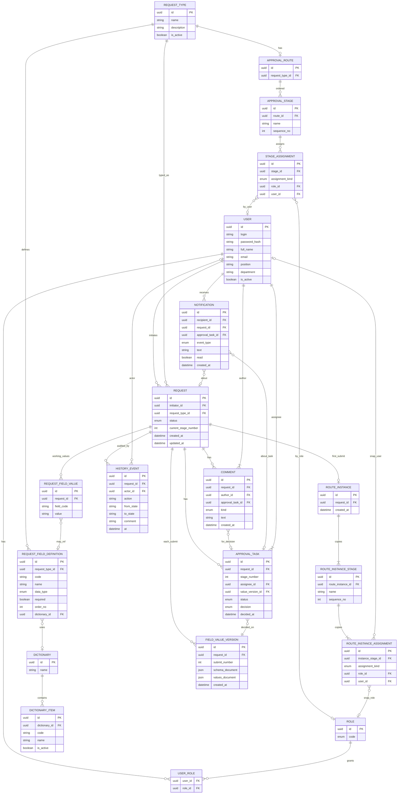

# ERD-DM — Logical Domain Model (ER Diagram)

**Продукт:** Employee Service  
**ID:** ERD-DM  
**Версия:** 1.0  
**Статус:** Baseline v1.0  
**Связанные документы:** [README.md](./README.md), [Snapshot Model](./snapshot-model.md)

---

## 1. Назначение

Логическая ER-модель сущностей Employee Service: связи, кардинальности, обязательность. Атрибуты детализированы в [data-dictionary.md](./data-dictionary.md).

Это **не** DDL PostgreSQL. Идентификаторы показаны как логические `id` (тип UUID на уровне анализа).

---

## 2. Диаграмма (Mermaid)

**Notification** — сущность сохранена; in-app путь (BR-23/29, FR-NOTIF-*) — **Future / backlog**, не MVP Baseline.

---

## 3. Кардинальности и обязательность связей

| От | К | Кардинальность | Обязательность / notes |
| :--- | :--- | :--- | :--- |
| User | UserRole | 1 — 0..N | Пользователь может иметь 0+ ролей; MVP seed — ≥1 |
| Role | UserRole | 1 — 0..N | |
| User | Request (initiator) | 1 — 0..N | Обязательный initiator на Request |
| RequestType | Request | 1 — 0..N | Обязательный type на Request |
| RequestType | RequestFieldDefinition | 1 — 0..N | Порядок `order_no`; `code` уникален в рамках типа |
| RequestType | ApprovalRoute | 1 — 0..1 | Для активации маршрут должен быть валиден (BR-18) |
| ApprovalRoute | ApprovalStage | 1 — 1..N (при валидном) | Строго последовательный `sequence_no` |
| ApprovalStage | StageAssignment | 1 — 1..N (при валидном) | role и/или user (BR-12) |
| RequestFieldDefinition | Dictionary | N — 0..1 | Только для data_type catalog |
| Dictionary | DictionaryItem | 1 — 0..N | |
| **Request** | **RouteInstance** | **1 — 0..1** | Появляется после первого successful submit; далее immutable |
| RouteInstance | RouteInstanceStage | 1 — 1..N | Копия на момент first submit |
| RouteInstanceStage | RouteInstanceAssignment | 1 — 1..N | |
| **Request** | **FieldValueVersion** | **1 — 0..N** | Одна версия на каждый successful submit; канон — [snapshot-model.md](./snapshot-model.md) |
| Request | RequestFieldValue | 1 — 0..N | Working values; мутабельны в draft/returned |
| Request | ApprovalTask | 1 — 0..N | Задачи только по RouteInstance |
| ApprovalTask | User (assignee) | N — 1 | Обязательный assignee |
| Request | Comment | 1 — 0..N | |
| Comment | ApprovalTask | N — 0..1 | Для kind=decision — желательная связь |
| Request | HistoryEvent | 1 — 0..N | Append-only прикладной аудит |
| User | Notification | 1 — 0..N | **Future / backlog**; только получатель видит свои (FR-NOTIF-02) |

---

## 4. Статусы и справочные enum (логический уровень)

| Enum | Значения | Сущность |
| :--- | :--- | :--- |
| Role.code | `employee`, `approver`, `admin` | Role |
| Request.status | `draft`, `in_approval`, `returned`, `approved`, `rejected`, `cancelled` | Request |
| Field data_type | `text`, `date`, `number`, `catalog` (минимум MVP) | RequestFieldDefinition |
| StageAssignment.assignment_kind | `role`, `user`, `role_and_user` (или эквивалент: заполнены role_id и/или user_id) | StageAssignment / RouteInstanceAssignment |
| ApprovalTask.status | `open`, `completed`, `cancelled` | ApprovalTask |
| ApprovalTask.decision | `approve`, `reject`, `return` (nullable пока open) | ApprovalTask |
| Comment.kind | `free`, `decision` | Comment |
| Notification.event_type | минимум по BR-23 (new_task, status_change, …); **Future / backlog** | Notification |

---

## 5. Ограничения целостности и бизнес-инварианты (logical)

| ID | Ограничение | Источник |
| :--- | :--- | :--- |
| C-01 | `Request.initiator_id` обязателен; create только роль employee (не admin «от имени») | BR-19, BR-27 |
| C-02 | RouteInstance создаётся только один раз на Request при first successful submit | BR-08 |
| C-03 | RouteInstance и его children неизменяемы после create | BR-09, BR-22 |
| C-04 | FieldValueVersion: append-only на каждый successful submit; решение bound to version | BR-22, BR-26 |
| C-05 | ApprovalTask создаётся только из RouteInstanceAssignment, не из live StageAssignment (для in-flight) | BR-08, BR-09 |
| C-06 | First-approve: при approve sibling `open` tasks того же stage_number → `cancelled` | BR-03 |
| C-07 | Исполнитель задачи ≠ initiator той же Request (self-approval ban) | BR-21 |
| C-08 | decision reject/return ⇒ непустой Comment.text (kind=decision) | BR-25 |
| C-09 | decision approve ⇒ Comment необязателен | BR-25 |
| C-10 | Cancel только из status `draft` \| `returned` | BR-07 |
| C-11 | Валидный маршрут при activate и submit: ≥1 stage, каждый ≥1 assignment | BR-18 |
| C-12 | `RequestFieldDefinition.code` уникален в рамках RequestType | FR-ADMIN-02 |
| C-13 | StageAssignment: хотя бы одно из role_id / user_id задано | BR-12 |
| C-14 | HistoryEvent не хранит полный snapshot payload как обязательное поле | Stage 3.4 decision / BR-24 |
| C-15 | Notification создаётся в той же логической транзакции, что и бизнес-событие (**Future / backlog**) | BR-29 |

Optimistic locking / version columns — **не** моделируются (вне MVP).

---

## 6. Соответствие UML-CL-01

| UML class | ERD entity | Уточнение Stage 3.4 |
| :--- | :--- | :--- |
| User, Role | USER, ROLE, USER_ROLE | + login, password_hash |
| RequestType, RequestFieldDefinition | то же | |
| Dictionary, DictionaryItem | то же | |
| ApprovalRoute/Stage, StageAssignment | то же | |
| Request | REQUEST | + timestamps |
| RouteInstance | ROUTE_INSTANCE + STAGE + ASSIGNMENT | Нормализация children |
| FieldValueVersion | FIELD_VALUE_VERSION | submit_number + schema/values documents (JSON logical) |
| — | REQUEST_FIELD_VALUE | Working values (явное отделение от snapshot) |
| ApprovalTask, Comment, Notification, HistoryEvent | то же | |

---

## 7. Границы

- Нет таблиц microservices / message outbox.
- Версионирование значений — **FieldValueVersion** (не отдельный SubmitVersion ID); см. [snapshot-model.md](./snapshot-model.md).
- Нет technical log tables.
- Нет оргструктуры.

---

## История изменений

| Версия | Дата | Описание |
| :--- | :--- | :--- |
| 1.0 | 2026-09-19 | Первая версия logical ERD |
