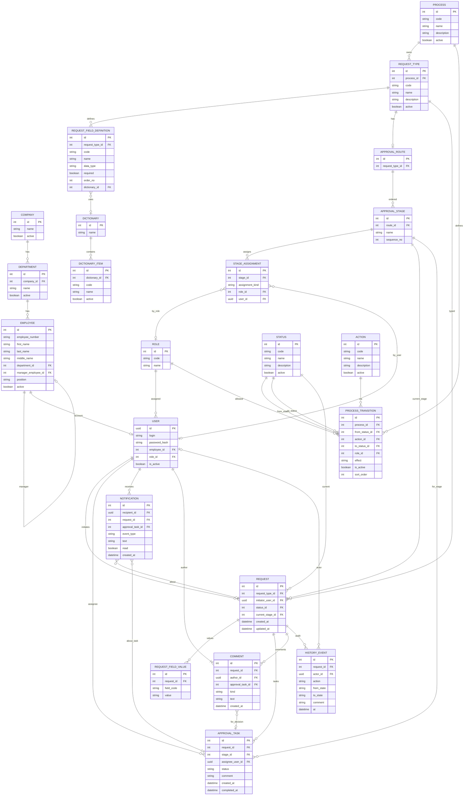

# ERD-DM — Logical Domain Model (ER Diagram)

**Продукт:** Employee Service  
**ID:** ERD-DM  
**Версия:** 2.0  
**Статус:** Target architecture (docs E0–E1)  
**Связанные документы:** [README.md](./README.md), [ADR-LIVE-CFG-01](../architecture/adr-live-config.md), [ADR-ACTION-01](../architecture/adr-configurable-actions.md), [ADR-ORG-01](../architecture/adr-org-model.md), [ADR-ID-01](../architecture/adr-id-strategy.md)

---

## 1. Назначение

Логическая ER-модель Employee Service после отказа от snapshot. Атрибуты — в [data-dictionary.md](./data-dictionary.md).

Это **не** DDL. Типы ID на логическом уровне: User — UUID; остальные сущности — integer ([ADR-ID-01](../architecture/adr-id-strategy.md)). Реализация смены типов — последующие этапы.

**Нет в модели:** `RouteInstance`, `RouteInstanceStage`, `RouteInstanceAssignment`, `FieldValueVersion`.

---

## 2. Диаграмма (Mermaid)

**Notification.event_type** (PG enum `notification_event_type`):
`new_task`, `status_change`, `request_submitted`, `request_approved`, `request_rejected`, `request_returned`, `request_cancelled`.

**Notification** — in-app persistence (E4.2); delivery channels remain backlog.

**Конфиг live:** ApprovalRoute* и ProcessTransition. См. [ADR-LIVE-CFG-01](../architecture/adr-live-config.md).

---

## 3. Кардинальности

| От | К | Кардинальность | Notes |
| :--- | :--- | :--- | :--- |
| Company | Department | 1 — 0..N | Демо: одна company |
| Department | Employee | 1 — 0..N | |
| Employee | Employee (manager) | N — 0..1 | Только данные; не auto-routing |
| Employee | User | 1 — 0..1 | Учётная запись |
| Role | User | 1 — 0..N | Одна роль на User |
| Process | RequestType | 1 — 0..N | |
| Process | ProcessTransition | 1 — 0..N | Live transitions |
| RequestType | ApprovalRoute | 1 — 0..1 | Live route |
| ApprovalRoute | ApprovalStage | 1 — 1..N (валидный) | `sequence_no` |
| ApprovalStage | StageAssignment | 1 — 1..N (валидный) | |
| Request | Status | N — 1 | `status_id` |
| Request | ApprovalStage | N — 0..1 | `current_stage_id` live |
| Request | ApprovalTask | 1 — 0..N | Tasks на live `stage_id` |
| ApprovalTask | ApprovalStage | N — 1 | Обязательный `stage_id` |
| Request | RequestFieldValue | 1 — 0..N | Working values only |

---

## 4. Справочные коды (логические)

| Область | Примеры code | UI |
| :--- | :--- | :--- |
| Status | `draft`, `in_approval`, `returned`, `approved`, `rejected`, `cancelled` | `Status.name` |
| Action | `submit`, `cancel`, `approve`, `reject`, `return` | `Action.name` |
| ProcessTransition.effect | `status_only`, `approve_advance` | не для UI |
| Role | `employee`, `approver`, `admin` | `Role.name` |
| ApprovalTask.status | `open`, `completed`, `cancelled` | |

Статусы и действия — **сущности** с `id/code/name`, не только enum на Request.

---

## 5. Инварианты (logical)

| ID | Ограничение | Источник |
| :--- | :--- | :--- |
| C-01 | `initiator_user_id` обязателен | BR-19 |
| C-02 | Нет RouteInstance / FieldValueVersion | ADR-LIVE-CFG-01 |
| C-03 | ApprovalTask создаётся из **live** StageAssignment текущего stage | ADR-LIVE-CFG-01, BR-08 |
| C-04 | `task.stage_id` и при согласовании `request.current_stage_id` согласованы | ADR-ACTION-01 |
| C-05 | First-approve: sibling open tasks того же stage → cancelled | BR-03 |
| C-06 | Self-approval ban | BR-21 |
| C-07 | reject/return ⇒ непустой комментарий | BR-25 |
| C-08 | Cancel только draft \| returned | BR-07 |
| C-09 | Валидный маршрут: ≥1 stage, каждый ≥1 assignment | BR-18 |
| C-10 | Не удалять stage при open tasks / in_approval на этот stage | BR-09, ADR-LIVE-CFG-01 |
| C-11 | ProcessTransition live; влияет на in-flight | ADR-LIVE-CFG-01 |

Optimistic locking / process versioning — **не** моделируются.

---

## 6. Границы

- Нет snapshot-таблиц.
- Нет microservices / outbox / Kafka.
- Нет орг-auto-routing по manager.
- Notification delivery — backlog.

---

## История изменений

| Версия | Дата | Описание |
| :--- | :--- | :--- |
| 1.1 | 2026-09-21 | ApprovalTask.created_at |
| 1.0 | 2026-09-19 | Logical ERD со snapshot |
| 2.0 | 2026-09-23 | Удалён snapshot; org; Process/Status/Action/Transition; status_id; current_stage_id; stage_id |
