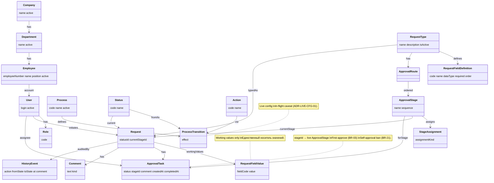

# UML-CL-01 — Conceptual Class Diagram (предметная модель)

**Продукт:** Employee Service  
**ID:** UML-CL-01  
**Версия:** 1.1  
**Статус:** Target architecture (docs E0–E1)  
**Связанные документы:** [uml-description.md](./uml-description.md), [erd-domain-model.md](../erd/erd-domain-model.md), [ADR-LIVE-CFG-01](../architecture/adr-live-config.md)

---

## 1. Назначение

Аналитическая (conceptual) модель сущностей предметной области Employee Service — мост между глоссарием / BR и ERD v2.

### Важно: это не ERD

| Conceptual Class (здесь) | ERD ([erd/](../erd/)) |
| :--- | :--- |
| Классы анализа, смысл предметной области | Таблицы, колонки, типы SQL |
| Связи и кратности на уровне бизнеса | PK / FK / индексы / нормализация |

Новые бизнес-правила **не вводятся**.

---

## 2. Каталог классов

### 2.1. Пользователи, роли, org

| Класс | Атрибуты (анализ) | Смысл |
| :--- | :--- | :--- |
| **User** | login, active | Пользователь системы |
| **Role** | code (`employee` / `approver` / `admin`) | Системная роль |
| **Company** | name, active | Организация (демо: одна) |
| **Department** | name, active | Подразделение |
| **Employee** | employeeNumber, name, position, active | Кадровая запись; не auto-routing |

### 2.2. Процесс и переходы (live)

| Класс | Атрибуты (анализ) | Смысл |
| :--- | :--- | :--- |
| **Process** | code, name, active | Контейнер процесса |
| **Status** | code, name | Статус заявки (сущность) |
| **Action** | code, name | Действие (submit, approve, …) |
| **ProcessTransition** | effect (`status_only` / `approve_advance`) | Live-переход process+status+action+role |

### 2.3. Каталог и конфигурация маршрута (live)

| Класс | Атрибуты (анализ) | Смысл |
| :--- | :--- | :--- |
| **RequestType** | name, description, isActive | Тип заявки / услуга каталога |
| **RequestFieldDefinition** | code, name, dataType, required, order | Поле live-схемы формы |
| **Dictionary** / **DictionaryItem** | name, code, isActive | Справочники |
| **ApprovalRoute** | — | Live-маршрут типа |
| **ApprovalStage** | name, sequence | Live-этап |
| **StageAssignment** | assignmentKind (role / user) | Явное назначение (BR-12) |

### 2.4. Экземпляр заявки (runtime)

| Класс | Атрибуты (анализ) | Смысл |
| :--- | :--- | :--- |
| **Request** | statusId, currentStageId | Экземпляр заявки; инициатор = User |
| **RequestFieldValue** | fieldCode, value | Working values (единственный носитель значений) |

### 2.5. Согласование, комментарии, аудит

| Класс | Атрибуты (анализ) | Смысл |
| :--- | :--- | :--- |
| **ApprovalTask** | status, stageId, comment, createdAt, completedAt | Задача на live `stageId`; assignee = User |
| **Comment** | text, kind (free / decision) | Свободный или decision-комментарий |
| **Notification** | text, read, eventType | In-app create+list — **Target**; mark-as-read — **Future / backlog** |
| **HistoryEvent** | action, fromState, toState, at, comment | Событие истории (BR-24) |

**Удалено из модели:** RouteInstance, FieldValueVersion — [ADR-LIVE-CFG-01](../architecture/adr-live-config.md).

---

## 3. Ключевые связи и ограничения (notes)

| Тема | Ограничение |
| :--- | :--- |
| Live route | ApprovalTask создаётся из **live** StageAssignment текущего stage |
| current_stage_id | Request.currentStageId → ApprovalStage; согласован с task.stageId |
| RequestFieldValue | Working values; мутабельны в draft/returned по live schema (BR-26) |
| First-approve | При approve прочие open задачи того же stageId → cancelled (BR-03) |
| Self-approval | Assignee ≠ initiator Request (BR-21) |
| Config caveat | Изменение live-маршрута **может** затронуть in-flight (ADR-LIVE-CFG-01) |

---

## 4. Диаграмма (Mermaid)

---

## 5. Трассировка

| Тип | ID |
| :--- | :--- |
| **UC** | UC-03…UC-15 (структура предметной области) |
| **FR** | FR-CAT-*, FR-REQ-*, FR-APP-*, FR-AUDIT-* |
| **BR** | BR-01, BR-03, BR-08, BR-09, BR-12, BR-21, BR-22, BR-24–27 |
| **ERD** | [erd-domain-model.md](../erd/erd-domain-model.md) v2 |

---

## 6. Границы

- Нет RouteInstance / FieldValueVersion.
- Нет API DTO и слоёв приложения.

---

## История изменений

| Версия | Дата | Описание |
| :--- | :--- | :--- |
| 1.0 | 2026-09-19 | Первая версия со snapshot |
| 1.1 | 2026-09-23 | ERD v2; Process/Status/Action; org; snapshot removed |
