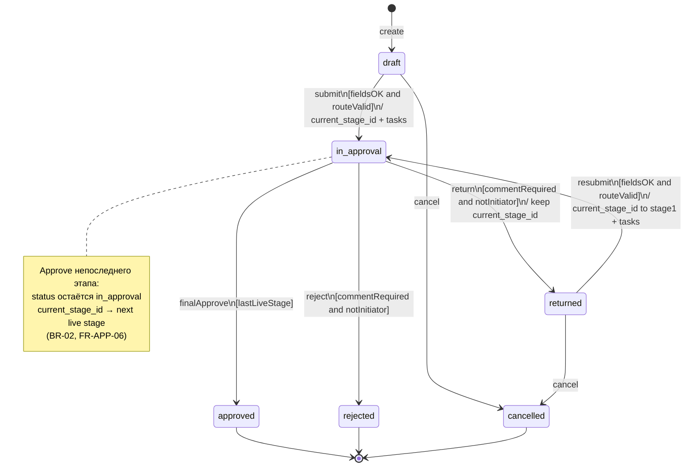

# UML-SM-01 — State Machine: статус заявки

**Продукт:** Employee Service  
**ID:** UML-SM-01  
**Версия:** 1.1  
**Статус:** Target architecture (docs E0–E1)  
**Связанные документы:** [uml-description.md](./uml-description.md), [ADR-LIVE-CFG-01](../architecture/adr-live-config.md)

---

## 1. Назначение

Формальная модель жизненного цикла заявки по статусам MVP. Переходы и guard-условия взяты из глоссария и BR.

---

## 2. Объект

**Контекст:** экземпляр заявки (`Request`).

**Атрибуты состояния (уровень анализа):** `status_id` (→ Status), `current_stage_id` (FK на live ApprovalStage, nullable вне in_approval).

---

## 3. Состояния

| Состояние | Смысл | Допустимые действия инициатора |
| :--- | :--- | :--- |
| `draft` | Черновик; не на согласовании | edit, submit, cancel |
| `in_approval` | На согласовании по live-маршруту | свободный комментарий (BR-28); cancel **запрещён** |
| `returned` | Возвращена на доработку; `current_stage_id` хранит этап возврата | edit, resubmit, cancel |
| `approved` | Финальное согласование | терминальное |
| `rejected` | Отклонена | терминальное |
| `cancelled` | Отменена инициатором | терминальное |

---

## 4. Переходы

| From | To | Событие / действие | Guard | Effect (существующие BR) |
| :--- | :--- | :--- | :--- | :--- |
| `[начальное]` | `draft` | create | тип активен (BR-10) | инициатор = текущий пользователь (BR-19) |
| `draft` | `in_approval` | submit | поля OK (BR-26); live-маршрут валиден (BR-18); тип активен | `current_stage_id` → первый live-этап; ApprovalTask из live assignments; история |
| `draft` | `cancelled` | cancel | — | история (BR-07) |
| `in_approval` | `approved` | finalApprove | approve на последнем live-этапе (BR-17) | закрытие задач |
| `in_approval` | `rejected` | reject | комментарий непустой (BR-25); не инициатор (BR-21); своя open задача (BR-15) | закрытие открытых задач этапа (BR-04) |
| `in_approval` | `returned` | return | комментарий непустой (BR-25); BR-21; BR-15 | сохранить `current_stage_id`; закрыть задачи этапа (BR-05) |
| `returned` | `in_approval` | resubmit | поля OK по live-схеме; маршрут валиден; тип активен | `current_stage_id` → первый live-этап; новые ApprovalTask этапа 1 (BR-06, BR-22) |
| `returned` | `cancelled` | cancel | — | история (BR-07) |

### 4.1. Отклонённые / невозможные переходы (notes)

| Попытка | Результат | Правило |
| :--- | :--- | :--- |
| cancel из `in_approval` / `approved` / `rejected` / `cancelled` | ERR_INVALID_STATE | BR-07 |
| submit из иного статуса, чем `draft`/`returned` | ERR_INVALID_STATE | BR-20 |
| reject/return без комментария | ERR_VALIDATION; статус без изменений | BR-25 |
| approve/reject/return инициатором по своей заявке | ERR_FORBIDDEN_APPROVAL | BR-21 |

Промежуточный «переход этапа» при approve непоследнего этапа **не меняет** `status`: заявка остаётся `in_approval` (BR-02, FR-APP-06).

---

## 5. Диаграмма (Mermaid)

---

## 6. Live config (кратко)

Канон: [ADR-LIVE-CFG-01](../architecture/adr-live-config.md).

| Момент | current_stage_id | ApprovalTask |
| :--- | :--- | :--- |
| Первый `draft → in_approval` | Первый live ApprovalStage | Из live StageAssignment |
| `returned → in_approval` | Снова первый live-этап | Новые задачи этапа 1 |
| Approve непоследнего этапа | Следующий live ApprovalStage | Новые задачи следующего этапа |

---

## 7. Трассировка

| Тип | ID |
| :--- | :--- |
| **UC** | UC-04, UC-05, UC-08, UC-09, UC-10 |
| **FR** | FR-REQ-01, FR-REQ-03, FR-REQ-07, FR-REQ-08, FR-REQ-09; FR-APP-04…07 |
| **BR** | BR-04…08, BR-17, BR-18, BR-19, BR-20, BR-21, BR-22, BR-25, BR-26 |
| **AC** | AC-APP-01, AC-APP-02, AC-APP-05b, AC-APP-06, AC-APP-07, AC-APP-08, AC-REQ-07, AC-DRAFT-01, AC-DRAFT-02 |
| **BPMN** | BPMN-01, BPMN-02 |

---

## 8. Границы

- Статусы **задачи** (`open` / `completed` / `cancelled`) — UML-CL-01 и UML-SEQ-02.
- RouteInstance / FieldValueVersion **не** используются.

---

## История изменений

| Версия | Дата | Описание |
| :--- | :--- | :--- |
| 1.0 | 2026-09-19 | Первая версия |
| 1.1 | 2026-09-23 | current_stage_id; без snapshot |
