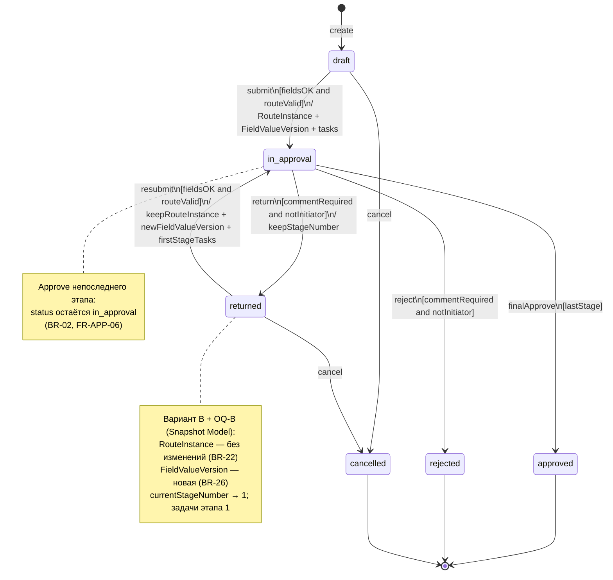

# UML-SM-01 — State Machine: статус заявки

**Продукт:** Employee Service  
**ID:** UML-SM-01  
**Версия:** 1.0  
**Статус:** Baseline v1.0  
**Связанные документы:** [uml-description.md](./uml-description.md), [Snapshot Model](../erd/snapshot-model.md)

---

## 1. Назначение

Формальная модель жизненного цикла заявки по статусам MVP. Переходы и guard-условия взяты из глоссария и BR; новые статусы и правила **не добавляются**.

---

## 2. Объект

**Контекст:** экземпляр заявки (`Request`).

**Атрибуты состояния (уровень анализа):** `status`, признак текущего этапа (для `in_approval` / после `return`), наличие RouteInstance и текущей FieldValueVersion ([Snapshot Model](../erd/snapshot-model.md)).

---

## 3. Состояния

| Состояние | Смысл | Допустимые действия инициатора |
| :--- | :--- | :--- |
| `draft` | Черновик; не на согласовании | edit, submit, cancel |
| `in_approval` | На согласовании по route snapshot | свободный комментарий (BR-28); cancel **запрещён** |
| `returned` | Возвращена на доработку; номер этапа возврата сохранён (аудит) | edit, resubmit, cancel |
| `approved` | Финальное согласование | терминальное |
| `rejected` | Отклонена | терминальное |
| `cancelled` | Отменена инициатором | терминальное |

---

## 4. Переходы

| From | To | Событие / действие | Guard | Effect (существующие BR) |
| :--- | :--- | :--- | :--- | :--- |
| `[начальное]` | `draft` | create | тип активен (BR-10) | инициатор = текущий пользователь (BR-19) |
| `draft` | `in_approval` | submit | поля OK (BR-26); маршрут валиден (BR-18); тип активен | **RouteInstance** (BR-08) + **FieldValueVersion** (BR-26); задачи 1-го этапа; история |
| `draft` | `cancelled` | cancel | — | история (BR-07) |
| `in_approval` | `approved` | finalApprove | approve на последнем этапе RouteInstance (BR-17) | закрытие задач; уведомление инициатору (если в scope) |
| `in_approval` | `rejected` | reject | комментарий непустой (BR-25); не инициатор (BR-21); своя открытая задача (BR-15) | закрытие открытых задач этапа (BR-04) |
| `in_approval` | `returned` | return | комментарий непустой (BR-25); BR-21; BR-15 | сохранить номер этапа; закрыть задачи этапа (BR-05) |
| `returned` | `in_approval` | resubmit | поля OK по актуальной схеме; маршрут валиден; тип активен | **RouteInstance не менять** (BR-22); **новая** FieldValueVersion (BR-26); `currentStageNumber` → 1; задачи **первого** этапа (BR-06) |
| `returned` | `cancelled` | cancel | — | история (BR-07) |

### 4.1. Отклонённые / невозможные переходы (notes)

| Попытка | Результат | Правило |
| :--- | :--- | :--- |
| cancel из `in_approval` / `approved` / `rejected` / `cancelled` | ERR_INVALID_STATE | BR-07 |
| submit из иного статуса, чем `draft`/`returned` | ERR_INVALID_STATE | BR-20 |
| reject/return без комментария | ERR_VALIDATION; статус без изменений | BR-25 |
| approve/reject/return инициатором по своей заявке | ERR_FORBIDDEN_APPROVAL | BR-21 |

Промежуточный «переход этапа» при approve непоследнего этапа **не меняет** `status`: заявка остаётся `in_approval` (BR-02, FR-APP-06).

---

## 5. Диаграмма (Mermaid)

---

## 6. Связь с Snapshot Model (кратко)

Канон: [Snapshot Model](../erd/snapshot-model.md).

| Момент | RouteInstance | FieldValueVersion |
| :--- | :--- | :--- |
| Первый `draft → in_approval` | Создаётся | Версия #1 |
| `returned → in_approval` | Без изменений | Новая версия |
| Пока `in_approval` | Чтение next stage | Текущая версия для согласующих |

---

## 7. Трассировка

| Тип | ID |
| :--- | :--- |
| **UC** | UC-04, UC-05, UC-08, UC-09, UC-10 |
| **FR** | FR-REQ-01, FR-REQ-03, FR-REQ-07, FR-REQ-08, FR-REQ-09; FR-APP-04, FR-APP-05, FR-APP-06, FR-APP-07 |
| **BR** | BR-04, BR-05, BR-06, BR-07, BR-08, BR-17, BR-18, BR-19, BR-20, BR-21, BR-22, BR-25, BR-26; BR-29 — **Future / backlog** |
| **AC** | AC-APP-01, AC-APP-02, AC-APP-05b, AC-APP-06, AC-APP-07, AC-APP-08, AC-REQ-07, AC-DRAFT-01, AC-DRAFT-02 |
| **BPMN** | BPMN-01 (жизненный цикл), BPMN-02 (исходы этапа) |

---

## 8. Границы

- Статусы **задачи** согласования (`open` / `completed` / `cancelled`) — на UML-CL-01 и UML-SEQ-02, не отдельные состояния заявки.
- Новые статусы заявки не вводятся.
