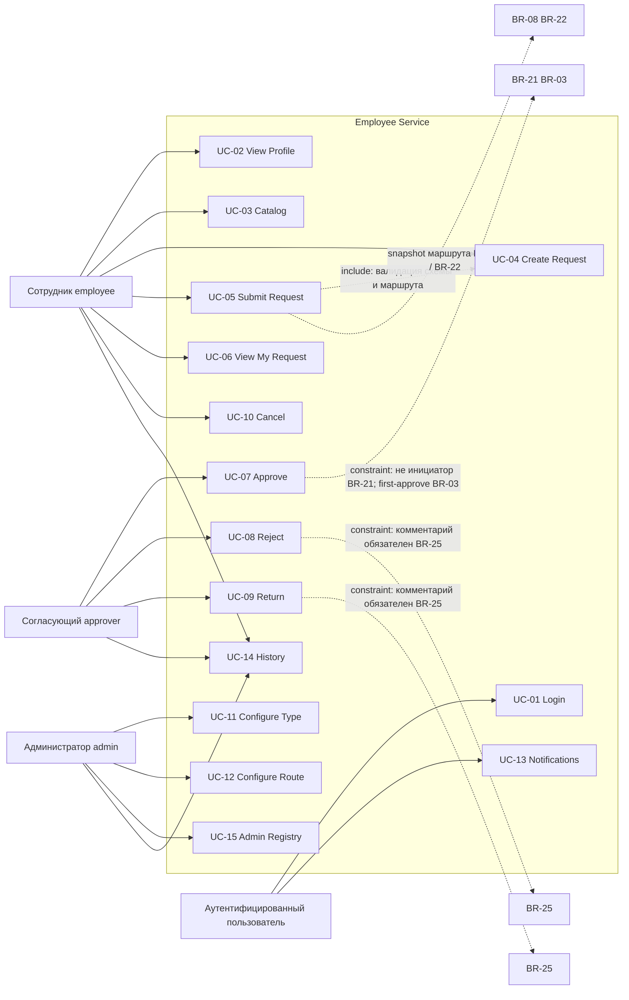

# UML-UC-01 — Use Case Overview

**Продукт:** Employee Service  
**ID:** UML-UC-01  
**Версия:** 1.0  
**Статус:** Baseline v1.0  
**Связанные документы:** [uml-description.md](./uml-description.md), [Use Cases](../../02-requirements/use-cases.md)

---

## 1. Назначение

Обзор границ системы Employee Service и связей актёров с пользовательскими сценариями UC-01…UC-15. Диаграмма задаёт контекст для sequence / state / class моделей Этапа 3.2 и дополняет BPMN (где процессы login/catalog/просмотр не выносились отдельно).

Новые use case и бизнес-правила **не вводятся**.

---

## 2. Актёры

| Актёр | Код роли | Описание |
| :--- | :--- | :--- |
| **Сотрудник (Инициатор)** | `employee` | Создаёт и ведёт свои заявки; профиль; каталог |
| **Согласующий** | `approver` | Очередь задач; approve / reject / return |
| **Администратор** | `admin` | Типы, поля, маршрут, назначения, справочники; реестр |
| **Аутентифицированный пользователь** | — | Обобщение для входа и уведомлений; конкретные роли — specialization |

Один пользователь может иметь несколько ролей одновременно (BR-16, union permissions). Выбор «активной роли» не требуется.

---

## 3. Пакеты сценариев

| Пакет | UC | Кратко |
| :--- | :--- | :--- |
| Auth & кабинет | UC-01, UC-02, UC-13 | Login, профиль, in-app уведомления |
| Каталог и заявки | UC-03, UC-04, UC-05, UC-06, UC-10 | Каталог, draft, submit, просмотр, отмена |
| Согласование | UC-07, UC-08, UC-09 | Approve / reject / return |
| Администрирование | UC-11, UC-12, UC-15 | Тип/поля/маршрут; реестр |
| История | UC-14 | Хронология по заявке (в рамках прав) |

---

## 4. Матрица актёров × UC

| UC | Название | Employee | Approver | Admin | Auth user |
| :--- | :--- | :---: | :---: | :---: | :---: |
| UC-01 | Login | — | — | — | Primary |
| UC-02 | View Profile | Primary | — | — | (свои данные) |
| UC-03 | Browse Service Catalog | Primary | — | — | — |
| UC-04 | Create Request | Primary | — | — | — |
| UC-05 | Submit Request | Primary | — | — | — |
| UC-06 | View My Request | Primary | — | — | — |
| UC-07 | Approve Request | — | Primary | — | — |
| UC-08 | Reject Request | — | Primary | — | — |
| UC-09 | Return Request | — | Primary | — | — |
| UC-10 | Cancel Request | Primary | — | — | — |
| UC-11 | Configure Request Type | — | — | Primary | — |
| UC-12 | Configure Approval Route | — | — | Primary | — |
| UC-13 | View Notifications | — | — | — | Primary |
| UC-14 | View Request History | Primary* | Primary* | Primary | — |
| UC-15 | Admin View Requests | — | — | Primary | — |

\* В рамках прав видимости: свои заявки / заявки по своей задаче / все (admin) — BR-01, BR-13, BR-14.

---

## 5. Диаграмма (Mermaid)

Примечания к связям:

- `include` показан упрощённо: submit опирается на созданную/заполненную заявку (UC-04) и проверки BR-18 / BR-26.
- Constraints на UC-07…09 и UC-05 — **существующие** BR, не новые use case.

---

## 6. Аннотации ключевых правил на UC

| UC | Правило | Смысл |
| :--- | :--- | :--- |
| UC-05 | BR-08, BR-22, BR-26 | Первый submit → route snapshot; каждый submit → schema/value snapshot; resubmit не трогает route |
| UC-07 | BR-03, BR-21, BR-25 | First-approve wins; запрет самосогласования; комментарий при approve необязателен |
| UC-08, UC-09 | BR-21, BR-25 | Запрет самосогласования; комментарий обязателен |
| UC-10 | BR-07 | Отмена только `draft` / `returned` |
| UC-11, UC-12 | BR-09, BR-18, BR-27 | Изоляция snapshot; валидация маршрута при активации; admin не создаёт заявки от сотрудника |

---

## 7. Трассировка

| Тип | ID |
| :--- | :--- |
| **UC** | UC-01…UC-15 |
| **FR** | FR-AUTH-*, FR-CAB-*, FR-CAT-*, FR-REQ-*, FR-APP-*, FR-NOTIF-*, FR-AUDIT-*, FR-ADMIN-* (обзорно) |
| **BR** | BR-01, BR-03, BR-07, BR-08, BR-09, BR-13–16, BR-21, BR-22, BR-25, BR-26, BR-27 |
| **AC** | AC-AUTH-01, AC-ACC-*, AC-CAT-*, AC-APP-* (обзорно через связанные UC) |
| **RBAC** | матрица ролей; ACL-01…ACL-09 |

---

## 8. Границы

- Детали взаимодействий — UML-SEQ-01…03.
- Статусы заявки — UML-SM-01.
- Структура предметной области — UML-CL-01.
- Процессные потоки — BPMN-01…03.
- Новые правила не вводятся.
